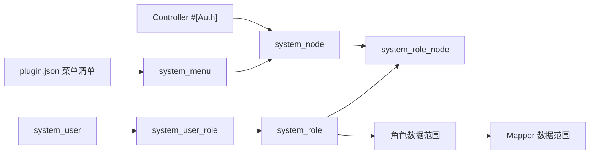

# 权限与菜单

System 后台采用“菜单入口 + 权限节点 + 角色授权 + 注解校验”的 RBAC 模型。菜单负责后台用户看见什么，权限节点负责接口能不能访问，角色负责把两者授予 `SystemUser`。

Project 应用入口不接入 System RBAC：`ProjectAccount` 使用 `ProjectRole` 内置角色矩阵计算权限码，访问路径限定在 `/project/**`。

插件有两类前端声明：`plugin.json` 声明 System 后台菜单、按钮和 view；`auth-entry.ts` 声明插件独立前台入口、登录页、路由范围和前台菜单。Web 壳按插件清单在编译期扫描，不为某个插件写死登录页或业务路由。

## 模型图



## 权限来源

| 来源 | 说明 |
|------|------|
| `#[Auth]` 注解 | System 后台 Controller 和 Action 声明接口权限、权限码、登录要求 |
| `plugin.json` 菜单清单 | 插件声明后台应用、菜单、view、按钮 code 和模块摘要 |
| `system_node` | 菜单 code 与 SystemUser 注解扫描结果汇总后的权限节点 |
| `system_role_node` | System 角色和权限节点关系 |
| 用户角色关系 | SystemUser 最终权限由角色聚合得到 |

> Project 插件的 `/system/project/**` 后台接口仍使用上表的 System RBAC；`/project/**` 应用接口只校验 `ProjectAccount + ProjectRole`，不写入 `system_node`。

## 菜单和节点的区别

| 对象 | 表 | 作用 | 示例 |
|------|----|------|------|
| 菜单 | `system_menu` | 前端可见入口和按钮声明 | 用户管理页面、编辑按钮 |
| 节点 | `system_node` | 后端可校验的权限点 | `system.user.update` |
| 角色节点 | `system_role_node` | 角色拥有的权限集合 | 管理员拥有用户编辑权限 |

菜单不等于权限。菜单负责“展示”，节点负责“校验”。按钮菜单通常会生成节点，但最终以后端 `#[Auth]` 校验为准。

## 同步链路

```bash
sh bin/start-swoole xadmin:menu:sync --details
sh bin/start-swoole xadmin:node:sync --details
```

菜单同步负责把 `plugin.json` 清单写入菜单表；节点同步负责把菜单 code 和 SystemUser 后台 `#[Auth]` 注解收敛到 `system_node`。发布检查中会执行 dry-run，避免后台 RBAC 权限遗漏进入发布包。

这些同步命令是源码/CI 构建职责。已发布 Phar/SFX 二进制会隐藏 `xadmin:menu:sync` 和 `xadmin:node:sync`，仅在权限注册表异常等极端修复时允许精确执行；生产常规升级不再提示用户手工同步菜单或节点。

同步顺序建议：

1. 修改 Controller `#[Auth]` 注解或插件 `plugin.json`。
2. 执行 `xadmin:menu:sync --dry-run --json` 校验插件菜单清单。
3. 执行 `xadmin:node:sync --dry-run --json` 校验权限节点。
4. 确认无误后执行 `xadmin:menu:sync --details` 和 `xadmin:node:sync --details`。
5. 在角色授权页面确认新节点并给目标角色授权。
7. 使用普通用户重新登录验证。

dry-run 用于发布前检查，不应修改数据库：

```bash
sh bin/start-swoole xadmin:menu:sync --dry-run --json
sh bin/start-swoole xadmin:node:sync --dry-run --json
```

## 权限码约定

- 菜单页面通常使用 `module.resource.index`。
- 新增、编辑、删除等按钮使用 `module.resource.create/update/delete` 等后端真实权限码；前端导出不再新增后端导出权限码。
- 非标准接口如果影响用户可见数据，也必须有明确权限码。
- 前端按钮权限必须与后端 `#[Auth]` code 一致。

推荐动作：

| 动作 | code 后缀 |
|------|-----------|
| 列表/查看 | `index` |
| 新增 | `create` |
| 编辑/状态/排序 | `update` |
| 删除到回收站 | `delete` |
| 恢复 | `recovery` |
| 彻底删除 | `real-delete` |
| 授权 | `assign` |
| 上传配置 | `upload-config` |
| 清理/清空 | `clear` |

权限码命名要稳定。权限码一旦进入角色授权和前端按钮控制，随意改名会导致历史角色失权。

## 运行时校验

请求进入受保护接口时，`AuthAspect` 会读取 `#[Auth]` 注解，先校验 Token 中的用户模型是否与注解声明一致，再结合当前登录用户、权限码和超级管理员标识判断是否放行。Token 缺失或失效返回 `401`，Token 有效但无权限返回 `403`，业务失败按项目规范返回 `500`。

| 接口范围 | 用户模型 | 权限来源 |
|----------|----------|----------|
| `/system/**`、`/system/project/**` | `SystemUser` | `system_role_node` |
| `/project/**` | `ProjectAccount` | `ProjectRole` |
| `/system/data/ui-meta` | `UserModelInterface` | 任意有效登录态，仅返回低敏 UI 元信息 |

`UserModelInterface` 只用于跨入口共享的低敏元信息接口。个人资料、权限码、业务列表、统计和配置接口必须继续绑定具体用户模型，避免插件前台账号越过 System RBAC。

## 前端权限使用

前端通常使用两类数据：

| 数据 | 用途 |
|------|------|
| 用户菜单 | 生成左侧菜单和动态路由 |
| 权限码集合 | 判断页面按钮是否显示 |

前端权限只是交互控制。用户即使绕过前端直接请求接口，后端 `#[Auth]` 仍会校验权限码。

## 数据范围

数据范围不是前端过滤，而是 Mapper 查询层约束。标准 CRUD 默认走 `CoreMapper` 的数据范围保护方法；用户选项、统计、详情、更新、删除等非标准接口也必须显式考虑数据范围。前端导出复用列表接口，因此导出结果也受列表数据范围约束。

## 典型问题

| 现象 | 原因 | 处理 |
|------|------|------|
| 菜单不显示 | 菜单未同步、角色未授权、菜单禁用 | 同步菜单节点，检查角色授权和菜单状态 |
| 按钮不显示 | 按钮 code 不在权限集合 | 检查按钮节点和前端权限码 |
| 按钮显示但接口 403 | 后端 `#[Auth]` code 与前端 code 不一致 | 统一权限码并重新同步节点 |
| 接口 401 | Token 缺失或失效 | 重新登录或检查刷新接口 |
| 列表看不到数据 | 数据范围限制 | 检查角色 scope、用户部门、Mapper 字段 |
| 能越权更新别人的数据 | 非列表接口绕过数据范围 | 检查详情、更新、删除接口 |

## 新模块接入检查

- Controller 类和所有受保护 Action 都有 `#[Auth]`。
- 写操作都加 `#[Logger]`。
- `plugin.json` 包含应用、菜单、view 和按钮权限。
- 菜单 code、按钮 code、Controller code、前端按钮 code 一致。
- 角色授权树能看到新增节点。
- 普通用户重新登录后权限生效。
- 数据范围覆盖列表、详情、更新、删除、统计和选项。

最后更新：2026-05-18
