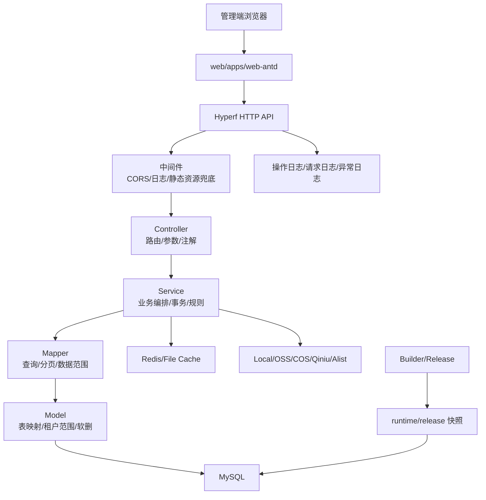
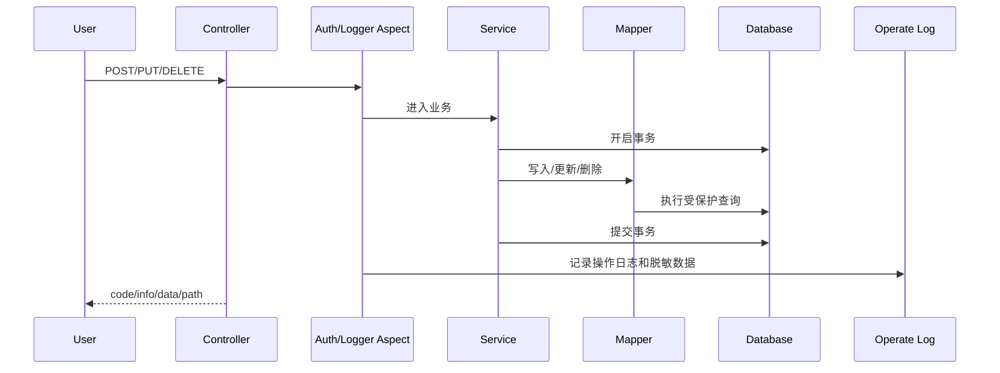

# 系统架构

SmartAdmin 的后端核心位于 `plugin/*`，前端核心位于 `web/apps/web-antd`。系统按“基础能力层、系统管理层、构建发布层”拆分，目标是让新模块低成本接入，同时保持权限、数据范围、租户隔离和发布升级可控。

## 总体视图

这张图表达的是运行时主链路：前端通过 API 调用后端，后端在 Controller 层完成路由与注解声明，在 Service 层处理业务规则，在 Mapper/Model 层统一处理数据范围、租户隔离、软删除和查询。

## 插件分层

| 层级 | 目录 | 职责 |
|------|------|------|
| 基础能力层 | `plugin/Library` | Core 基类、注解、切面、中间件、异常、日志、数据范围、租户上下文、发布快照 |
| 系统管理层 | `plugin/System` | 登录、用户、角色、菜单、部门、岗位、租户、文件、日志、公告、系统数据 |
| 构建发布层 | `plugin/Builder` | Phar 打包、配置 AST 改写、二进制产物生成 |
| 管理端 | `web/apps/web-antd` | 通用前端壳、公共页面、共享组件、插件扫描和运行时配置 |

插件接入链路由几类标准入口共同完成：

| 入口 | 职责 |
|------|------|
| 本地 Composer path 包 | 为 `plugin/<Module>` 提供 autoload 和 Hyperf Provider 装配 |
| `Provider.php` | 声明注解扫描、依赖、监听器和命令等运行期装配 |
| `plugin.json` | 声明应用菜单、按钮权限、view、语言包、迁移目录、模块摘要和插件自有表范围 |
| Library 源码插件命令 | 源码/CI 环境使用 `xadmin:plugin:*` 打包、安装、移除、备份和恢复插件 ZIP；backup 默认只备份代码，`--with-data` 才包含插件自有表 |
| 同步命令 | 源码/CI 环境使用 `xadmin:menu:sync`、`xadmin:node:sync` 保持菜单和权限节点一致 |
| Web 编译期扫描 | Vite 虚拟模块读取已配置 `plugin.view_root` 的页面、`routes.ts` 和 `auth-entry.ts`，并编入 `web/dist` |

## 关键目录

| 目录 | 内容 | 修改建议 |
|------|------|----------|
| `plugin/Library` | 全局基础能力 | 只放跨模块公共能力，修改后需要更完整测试 |
| `plugin/System` | 系统后台能力 | 新增系统级功能时优先复用现有分层，租户管理也归入这里 |
| `plugin/Builder` | 打包构建 | 发布、Phar、构建脚本相关能力放这里 |
| `plugin/<Business>` | 业务插件 | 独立业务能力优先放这里，并通过 `composer.json`、`plugin.json` 和 Provider 接入 |
| `migrations` | 开发期数据库迁移 | 用于 fresh 初始化，不作为生产升级唯一依据 |
| `config/autoload` | Hyperf 配置 | release、cache、dependencies 等配置入口 |
| `web/apps/web-antd` | 管理端运行库 | 通用布局、公共组件、共享依赖和插件 view 自动加载机制 |
| `docs` | docsify 文档站 | 独立静态站，不接入 Hyperf `/docs` 路由 |

## 后端分层

| 层 | 允许做什么 | 不应该做什么 |
|----|------------|--------------|
| Controller | 路由、参数读取、权限注解、日志注解、标准响应 | 写 SQL、放复杂业务、绕过 Service |
| Service | 业务编排、事务、唯一性校验、跨 Mapper 协同；复杂领域服务可拆成登录态、偏好、缓存、权限码、授权边界、关系分配和凭证等专用协作服务 | 保存请求态、用户态、Token 用户模型上下文等可变状态 |
| Mapper | 查询构建、分页、数据范围、软删、状态、列表后处理 | 接收 Request/Response、信任外部 raw SQL |
| Model | 表映射、fillable、hidden、关联、访问器、转换器 | 业务编排、跨表写事务 |

## 核心能力

| 能力 | 主要位置 | 说明 |
|------|----------|------|
| 统一响应 | `CoreController`、响应异常处理器 | 返回 `code/info/data/path`，HTTP status 固定 `200`，业务状态读取 body.code |
| 权限校验 | `#[Auth]`、Auth 切面、权限节点 | 登录态和权限码统一处理 |
| 操作日志 | `#[Logger]`、日志切面、日志记录器 | 写操作审计、敏感字段脱敏、模型变更记录 |
| 数据范围 | Scope 相关服务、`CoreMapper` | 列表、详情、更新、删除、统计和选项等接口的权限边界 |
| 租户隔离 | `TenantContext`、`CoreModel` | 有 `tenant_id` 且 fillable 包含该字段的模型自动接入 |
| 文件上传 | `FileUploadService`、Storage 驱动 | 支持本地、对象存储、分片、签名和上传配置 |
| 发布升级 | Release 命令、DBAL 快照 | 生产升级基于快照 diff，不直接依赖迁移逐条执行 |
| Phar 构建 | `plugin/Builder`、Composer scripts | 复用已生成 `web/dist`、同步菜单节点、生成快照、打包二进制 |

## 请求链路

1. 请求进入 Hyperf HTTP Server。
2. CORS、请求日志等中间件处理基础上下文。
3. Controller 路由命中，`#[Auth]` 和 `#[Logger]` 切面参与处理。
4. Service 编排业务，必要时开启事务。
5. Mapper 构建查询并套数据范围、租户范围。
6. Model 处理字段映射、转换器、软删和租户全局作用域。
7. 响应统一返回 `code/info/data/path`。

## 写操作链路

写操作比读操作多两个要求：权限审计和事务边界。

对于用户角色关系、公告接收人等不稳定触发模型字段事件的关系变更，Service 需要手动追加变更记录，避免审计链路断裂。

## 前端结构

Web 前端提供通用布局、运行库、公共组件和共享依赖，不承载具体业务插件页面。System 自带页面以及业务插件页面可以由插件目录自管理；插件通过 `plugin.json` 的 `plugin.view_root` 显式声明 view 根目录后，Web 在编译期自动读取 `plugin/*/plugin.json` 并映射插件 Vue 页面。当前机制不是运行时远程插件加载；通过 Library 内置 `xadmin:plugin:*` 在源码/CI 安装或恢复插件后，前端变化仍需要重新构建 `web/dist`。后端新增权限码、菜单、接口参数时，要同步检查对应插件页面的 API 类型、表单、按钮权限和路由声明。

## 前后端协作边界

| 后端变化 | 前端需要同步 |
|----------|--------------|
| 新增 Controller 接口 | API service、类型、页面调用 |
| 新增 `#[Auth]` code | 按钮权限、角色授权、菜单节点 |
| 修改表单必填字段 | 表单 schema、默认值、校验 |
| 修改枚举值 | 下拉选项、Tag 展示、筛选条件 |
| 修改响应结构 | API utils、页面解析逻辑 |
| 新增菜单 | `plugin.json` 的 route、view、图标、排序 |

## 扩展原则

- 新业务模块优先作为独立插件接入，避免把业务代码堆入 `System`。
- 当前插件通过本地 Composer path 包、Provider、`plugin.json`、菜单/节点同步和 Web 编译期扫描接入；插件前端页面、语言包、迁移目录和模块摘要分别由 `plugin.view_root`、`plugin.language_root`、`plugin.migration_root` 与 `apps[].menus[].module` 显式声明后生效。源码/CI 模式可使用 Library 内置 `xadmin:plugin:*` 管理插件 ZIP 与备份，备份数据需显式 `--with-data`，移除前自动备份必须带数据；已发布 Phar/SFX 二进制只运行已打包插件，不注册这些源码命令，也不在包内动态安装、更新或移除插件。
- 插件可以采用 Apache-2.0、MIT、会员授权、付费授权或私有协议，授权规则以插件自身 LICENSE 和 `plugin.json` 授权声明为准。
- 只有跨模块稳定复用的能力才上沉到 `Library`。
- 支持租户的表必须显式包含 `tenant_id`，并让 Model 接入通用租户范围。
- 数据范围必须在后端查询层完成，前端过滤不能作为安全边界。
- 发布升级相关数据要区分开发迁移、发布快照、受管数据和运行数据。
- 文档与实现同步更新，尤其是接口、权限码、菜单、上传配置、发布命令。

最后更新：2026-05-18
