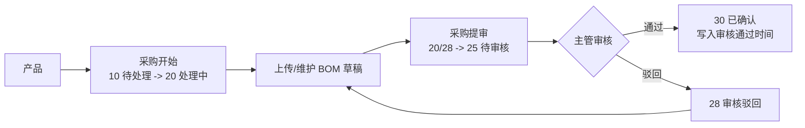

# 项目管理模块

> **会员授权 / 不随开源版源码分发：** 本页记录 Project 插件的业务规则、角色职责和页面闭环口径，公开文档站可展示规则说明，但源码或 ZIP 仍以会员授权或内部交付为准。

Project 模块覆盖产品、版本、功能点、主任务、子任务、整体验收单、Bug、采购分支、钉钉通知和个人工作台。后续修改状态流、按钮入口或通知规则前，应先对照本文档和当前源码。

## 核心规则

- **提验**：开发完成某个子任务后，提交给验收人确认；子任务进入 `25 待验收`。对 `acceptance_required=1` 的已发布任务，最后一个开发子任务提验使全部子任务达到 `25/30` 时，会在同一事务内自动创建首轮整体验收单。
- **验收通过**：验收人确认子任务完成；子任务进入 `30 已完成`。
- **自动发起整体验收**：首轮默认使用主任务验收人作为验收执行人，并按开发子任务生成验收项；子任务逐项验收和整体验收资料准备可以并行，但整单最终通过仍要求所有开发子任务均为 `30` 且不存在未关闭 Bug。
- **手工发起整体验收**：`task/submit-test/{id}` 保留给整体验收单自身取消或驳回后的后续轮次，以及 `acceptance_required=0` 的存量兼容任务；新任务上一轮已取消或驳回且全部子任务仍为 `25/30` 时即可重发，无需先全部验收到 `30`，但整单通过门禁不变。该入口不再作为新任务首轮默认入口。
- **强制闭环**：应用新建主任务固定写入 `acceptance_required=1`。没有验收单、验收中、取消或驳回时，来源主任务保持 `25 验收中`；最新整体验收单通过后才进入 `30 已完成`。
- **存量兼容**：数据库字段默认 `acceptance_required=0`，存量任务不补造验收单、不改变已有完成结论；一旦主动发起整体验收，未通过轮次仍参与状态门禁。
- **Bug 阻断**：未关闭或未标记非缺陷的 Bug 会阻断子任务、整体验收单或主任务进入最终闭环。
- **原子回滚**：自动建单时若存在未关闭 Bug、主任务验收人无效或无法生成默认验收项，本次最后提验整体回滚，不保留子任务状态、活动、通知或半成品验收单。
- **返工重建**：任一子任务撤回待验收或被验收驳回时，自动取消当前开放整体验收单并关闭待办，保留验收项、执行数据和历史；修复后再次全部提验会复制上一轮执行人和验收项生成新轮次。已存在开放单据或最新轮已通过时不重复建单。
- **草稿隔离**：任务草稿只在 Project 与 System 的任务管理页可见，不进入执行、统计、提醒或闭环修复链路。

## 状态口径

| 场景 | 子任务状态 | 主任务展示 |
| --- | --- | --- |
| 未开始 | `10 待处理` | 待处理 |
| 开发中 | `20 进行中` | 进行中 |
| 已提交验收，未验收通过 | `25 待验收` | 验收中（子任务待验收） |
| 部分子任务已提验 | 部分 `25/30` | 验收中（继续提验或验收子任务） |
| 新任务全部子任务已提验 | 全部 `25/30` | `25 验收中`（首轮整体验收单已自动生成） |
| 验收不通过 | 对应子任务 `50 返工中` | 已驳回 / 返工中；开放整体验收单自动取消 |
| 新任务全部子任务验收通过 | 全部 `30 已完成` | `25 验收中`（等待整体验收通过） |
| 整体验收单尚未通过 | 验收项按验收单推进 | `25 验收中` |
| 最新整体验收单通过 | 全部 `30 已完成` | `30 已完成` |
| 存量兼容任务无验收单 | 全部 `30 已完成` | 保留原 `30 已完成` 结论 |

主任务状态由 `ProjectTaskService::refreshOverallStatus()`、`summarizeSubtaskStatus()`、`acceptance_required` 和最新有效整体验收单门控汇总，不允许通过普通编辑表单人工改成完成。任务实际完成日期继续来自子任务事实日期，整体验收通过时间记录在兼容字段 `passed_at`，两者不互相覆盖。

### 任务发布状态

`project_task.publish_status` 与执行 `status` 是两套独立状态：`draft` 表示草稿，`published` 表示已发布。子任务汇总只更新执行状态和事实日期，不得覆盖发布状态；历史数据与新建普通任务默认为 `published`。

- 保存草稿时只要求标题非空，可暂缺产品、版本、功能点、负责人、验收人和子任务；发布时必须重新执行完整任务校验。
- Project 与 System 的任务管理分别使用 `task/manage-index` 和 `task/manage-info/{id}` 读取草稿；普通 `task/index`、`task/info/{id}` 以及看板、我的工作、流程、任务流、卡点、甘特、报表、引用选项和详情默认只返回 `published`。请求参数不能开启草稿读取。
- 新建表单的“保存为草稿”走 `task/draft`，“保存并发布”走原 `task/create`；`project.task.draft` 只控制新建草稿，已有草稿由创建人或具备 `project.task.update` 且命中数据范围的用户编辑、发布，不能通过普通更新接口伪造 `publish_status`。
- 开放任务发布成功后才发送任务指派通知并创建待办；保存或编辑草稿不发送通知。已取消任务重新发布只恢复已发布记录的可见性，不发送指派通知，也不恢复执行；重复发布同一状态不得重复建立待办。
- 已发布主任务仅在执行状态为 `10 待处理`、`20 进行中` 或 `40 已取消` 时可撤回，其中 `20` 表示任务已开始且已产生执行事实。Project 应用调用人必须具备 `project.task.update`，并同时命中当前租户、ProjectAccount 数据与任务责任操作范围；System 后台调用人必须具备同一权限码，并命中当前租户与 System 数据范围，不额外要求 ProjectAccount 责任关系。仅是任务创建人但没有更新权限时不允许撤回。
- `25 验收中`、`30 已完成`、`50 已驳回` 不允许撤回为草稿。主任务只要曾产生任何整体验收单，当前、软删除或彻底删除的轮次都会永久阻止撤回；彻底删除 `Txxx` 只删除单据，不清除来源任务“曾进入整体验收”的活动历史事实。撤回成功只把 `publish_status` 改为 `draft`，保留主任务、子任务执行状态、进度和实际日期，同时关闭已有待办并禁止后续工作流动作；取消任务重新发布后仍保持 `40 已取消`，不会自动恢复执行，其它可撤回状态也继续使用原执行事实。
- 撤回后已有非待处理状态、实际日期或验收日期的子任务属于执行事实，草稿编辑不得删除或改派；标题、说明和计划日期仍可维护。草稿管理详情通过 `collaboration` 内嵌只读评论、附件和活动，不调用仅支持已发布任务的普通协作接口。

## 任务列表双模式

Project 与 System 的任务页共用“主任务 / 子任务”两个 Tab，默认进入主任务模式。前端以 `task_view=main|subtask` 记忆当前模式；深链带 `subtask_id` 时进入子任务模式并打开对应节点详情。

- 主任务模式保持现有整单列表、草稿管理和任务级动作；子任务模式是全部可见已发布子任务的工作台，一行一个节点，不是“仅我的任务”。
- 主任务模式继续使用 `task/manage-index` 承载草稿管理；子任务模式使用普通 `task/index` 并固定传 `subtask_node=1`。后端从现有父任务读取范围派生子任务查询并在数据库中统计、排序和分页，不把父任务全量加载后在 PHP 拆行。
- 节点模式排除草稿、整体验收单和验收项。产品层级、分类、重点工作和抄送人按来源主任务筛选；状态、执行人、计划/实际/创建日期按子任务筛选；关键词同时支持父子标题/说明及 `#S`、`#ST` 编码。
- 节点按未关闭优先、计划完成日升序且空值最后、子任务 ID 降序稳定排列。当前逾期只统计状态非 `30/40` 且计划完成日早于应用当天的子任务。
- 节点行保留父任务上下文，并通过 `subtask_node_key/subtask_id/subtask` 标明当前子任务；`subtasks/my_subtasks` 只包含当前节点。按钮继续以节点 `can_*` 和写接口锁后复查为准。
- 公共筛选跨 Tab 联动；状态焦点和分页分别记忆。导出跟随当前模式，子任务模式按节点逐行输出父子编号、状态、责任人、日期、分类与重点工作。

## 任务绩效分类

任务增加两个正交的绩效事实维度，分类本身不改变任务状态、责任关系或数据范围：

| 维度 | 值 | 说明 |
| --- | --- | --- |
| 任务分类 | `department_plan`、`feedback_optimization`、`temporary` | 目标计划、反馈优化、临时任务；历史空值显示“未分类” |
| 重点工作 | `is_key_work=0/1` | 与任务分类并存，标记后进入 GS 非标准 KPI |

- 新建普通任务默认目标计划；新建并发布及草稿发布必须有分类，草稿阶段允许为空。Bug 转任务默认反馈优化并可在提交前调整。
- 整体验收单继承来源主任务的两个字段且不允许独立编辑；主任务历史纠偏沿用 `project.task.update` 和现有操作范围，并同步已有验收单、记录活动。
- 历史空分类不自动回填，不进入标准 KPI 或 GS，统一出现在“待归类任务”Sheet。
- 重点工作从目标计划完成率中排除，避免与 GS 重复统计；临时任务和反馈优化默认只进入闭环事实，标记重点工作后进入 GS。
- “目标计划”只表示工作性质，不新增部门字段或部门数据范围。
- Fresh 数据库与幂等增量迁移都包含两个字段；正式 Phar/SFX 仍通过 DBAL 安装快照升级，发布前先执行全量运行备份，不在生产包中运行迁移。

## 逾期口径

Project 全模块统一按责任节点计算逾期，任务列表、看板、甘特、任务流、流程进度、报表总览、人员及时率、闭环报表、风险报表和导出必须复用同一套规则：

- **开发逾期**：子任务 `actual_finish_at` 晚于子任务 `plan_finish_at`。
- **验收逾期**：子任务 `accepted_at` 晚于主任务 `plan_finish_at`；或子任务已进入 `25 验收中`、`accepted_at` 为空，并且当前日期已晚于主任务 `plan_finish_at`。
- **主任务逾期**：任意子任务发生验收逾期。主任务不再因为开发节点晚于子任务计划而直接算作主任务逾期。
- **当前逾期**：尚未完成且计划已过的普通节点；待验收超过主任务计划完成日必须归入验收逾期，不再降级为当前风险。
- **历史数据**：本规则只按真实业务字段计算。历史缺失或异常的 `accepted_at` 不通过迁移推导，需通过单独数据修复流程处理。

页面实时标签、统计卡、明细筛选和 Excel 导出必须保持同一结论：开发是否逾期看子任务自身完成情况，验收是否逾期看是否在主任务计划完成日前完成验收。

## KPI 与 GS 导出

Project 只导出事实、分子、分母和支撑明细，不计算 70/30 权重、绩效分、P0-P3 映射或扣分：

- 目标计划完成率按非重点目标计划的开发责任节点归责，输出应完成数、完成数和完成率。
- 反馈优化和临时任务默认只进入任务闭环明细，不形成独立标准 KPI 汇总。
- GS 只包含重点工作任务及责任节点，保留计划、实际、状态、按时和闭环证据。

Excel 保留任务节点和原始 Bug KPI 明细，并增加标准 KPI 汇总、GS 重点工作、待归类任务三个 Sheet；导出说明展示未分类数量警告。Bug 明细不受任务绩效筛选影响，也不进入本轮标准 KPI 或 GS；内部、外部 Bug 的绩效判定口径延期到定义明确后实施。

## 角色职责

| 角色 | 主要动作 |
| --- | --- |
| 管理员 | 可处理符合权限和状态的全部入口，仍受后端记录级校验限制。 |
| 产品 | 维护产品、版本、功能点、主任务计划，协调子任务验收和整体验收。 |
| 开发 | 开始子任务、提交待验收、处理 Bug 修复；全部开发子任务提验后由系统自动创建首轮整体验收单，具备权限时可处理后续或兼容轮次。 |
| 验收 | 验收子任务、处理整体验收单、创建和复测 Bug、标记非缺陷。内部角色码仍为 `tester`。 |
| 采购 | 处理采购待办、编辑 BOM 草稿并提交主管审核，不进入任务/Bug 主流程。 |
| 主管 | 只读查看 Project 主要业务数据，审核采购 BOM；不参与产品编辑、任务流转、整体验收或 Bug 处理。 |

### 角色职责节点矩阵

角色表示默认职责范围和权限模板；人员及时率采用严格归责：账号必须具备职责节点要求的业务角色，且记录责任字段指向该账号，才计入个人统计。管理员可以兜底处理，但不会因为有管理权限自动计入个人及时率，除非管理员账号同时具备对应业务角色并被记录字段明确指派。

| 职责节点 | 默认角色 | 责任字段 | 主要权限 | 进入及时率 | 用于我的工作/通知待办 |
| --- | --- | --- | --- | --- | --- |
| 产品规划 | 产品 | `product.owner_account_id` / `task.owner_account_id` | `project.product.update`、`project.task.update` | 否 | 否 |
| 自动发起首轮整体验收 | 子任务提验执行人 | `task.accept_account_id` / `subtask.account_id` | 沿用当前提验权限 | 否 | 提验事务自动处理 |
| 手工发起后续/兼容整体验收 | 产品、开发 | `task.owner_account_id` / `subtask.account_id` | `project.task.submit-test` | 否 | 我的工作 |
| 开发执行 | 开发 | `project_task_subtask.account_id` | `project.subtask.progress` | 是 | 我的工作、关键钉钉待办 |
| 子任务验收 | 验收 | `project_task.accept_account_id` | `project.subtask.accept` | 是 | 我的工作、关键钉钉待办 |
| 整体验收 | 验收 | `project_task.owner_account_id` | `project.test.finish`、`project.test.reject` | 是 | 我的工作、关键钉钉待办 |
| Bug 修复 | 开发 | `project_bug.fixer_account_id` | `project.bug.fix` | 否 | 我的工作、关键钉钉待办 |
| Bug 复测 | 验收 | `project_bug.retest_account_id` | `project.bug.retest` | 否 | 我的工作、关键钉钉待办 |
| 非缺陷确认 | 产品、验收 | `project_bug.owner_account_id` / `project_bug.retest_account_id` | `project.bug.invalid` | 否 | 我的工作 |
| 采购执行 | 采购 | `project_product.purchase_account_id` | `project.product.purchase-start`、`project.product.bom-draft`、`project.product.bom-submit` | 否 | 我的工作 |
| 采购审核 | 主管 | `project_product.purchase_status=待审核` | `project.product.bom-review` | 否 | 我的工作 |

人员及时率只统计“开发执行、子任务验收、整体验收”三类节点：开发执行只认开发角色，子任务验收和整体验收只认兼容角色码 `tester`。未指定责任人、账号不存在、角色不匹配的节点不计入个人及时率，会进入“职责异常”汇总和明细，供管理员清理错误指派。Bug 与采购当前作为待办和质量风险节点，不进入任务及时率分母。

新增的目标计划 KPI 是独立口径：只按实际任务执行节点的 `project_task_subtask.account_id` 归责，不按岗位、角色或 `identity` 文案过滤；缺失责任账号或计划期限的节点进入绩效数据异常清单，不能从 KPI 分母中静默消失。

按钮显示必须同时满足角色权限码和记录级 `can_*` 字段，后端接口仍是最终校验来源。

## 我的工作

`/project/portal` 是 Project 个人工作台，应优先让用户在当前页完成自己的待办：

- 子任务：开始执行、提交待验收、验收通过、验收不通过。
- 主任务：新任务全部开发子任务提验后自动生成首轮整体验收单；整单自身取消或驳回后的后续轮次，以及存量兼容任务，仍可通过“发起整体验收”人工确认。
- 整体验收单：维护或导入验收用例，执行验收项，最后验收通过或验收驳回。
- Bug：开始修复、提交修复、提复测、复测通过、复测不通过、标记非缺陷。
- 采购：开始采购、编辑 BOM、采购提审、主管审核通过/驳回。

“详情”“流程”“任务管理”“Bug 管理”保留为辅助入口，用于查看完整上下文、复杂编辑和历史排查；个人处理动作不应只做成跳转。

### 验收用例导入

整体验收列表和我的工作都提供“导入验收用例”。入口以 `project.test.update` 和记录级 `can_import_cases` 共同判断，仅支持状态 `10/20/25` 且结论为 `pending` 的整体验收单。

- 模板字段固定为验收用例标题、执行人 ID、操作步骤、预期结果和备注；文件不超过 5 MB，每批最多 500 条。
- 导入是原子批次，请求顶层只接受 `request_id/rows`，行内只接受模板对应的五个规范字段；任一行无效或出现额外字段时整批不提交。
- 前端在同一上传与重试会话中复用 `request_id`；仍具备权限和数据范围时，即使整体验收单随后完成、驳回或取消，后端仍幂等重放首次结果，避免网络结果不确定时重复创建验收项。
- 导入项固定为待处理且日期为空，只作为验收和重点工作闭环证据，不代表执行结论，也不自动创建 Bug。写入后会按全部验收项重新汇总整体验收单状态，但不会增加 KPI/GS 工作项数量。

## 钉钉期限提醒

Project 任务期限提醒通过 System 调度内核注册为 `project.dingtalk.deadline-reminder`，固定归属 `project:project_app:0`，默认每天 `08:00` 执行。该计划只扫描父任务 `type=task`，不扫描整体验收单；调度参数默认 `due_soon_days=3`、`limit=200`。

提醒分两类：

- `project_task_due_soon`：计划完成日期 `plan_finish_at` 在今天到未来 3 天内，默认关闭。
- `project_task_overdue`：计划完成日期早于今天，默认关闭。

是否真正发送由 Project 钉钉应用配置和钉钉消息规则共同决定。消息规则页可分别为“即将逾期提醒”和“逾期提醒”配置多个固定抄送 Project 账号；固定抄送只追加通知，不替代负责人、执行人等原接收人。固定抄送人与任务接收人重复时只发送一次并保留原职责前缀；仅固定抄送命中的人使用“仅知会”前缀。未绑定钉钉用户的固定抄送账号允许保存，发送时按现有失败日志记录；已禁用账号会在发送时跳过，不自动改写配置。

旧版外部 crontab 命令 `xadmin:project:dingtalk:remind --type=due-today/overdue` 仅作为兼容入口保留。新环境应使用 System 调度任务；如果旧 crontab 与新调度并行，今日到期与即将逾期会按“同一天同一任务同一接收人只提醒一次”去重。扫描按 `plan_finish_at`、`id` 升序处理，`limit` 命中时优先覆盖最早到期任务；期限提醒失败也会保留失败发送日志用于当天去重。调度结果中的 `sent` 兼容旧字段，语义为成功写入发送日志的接收人数；详细统计包含 `scanned_tasks`、`triggered_tasks`、`sent_receivers`、`failed_receivers`、`skipped_tasks` 和 `skipped_receivers`，其中 `skipped_tasks` 记录配置关闭、规则关闭、无接收人等任务级跳过原因，`skipped_receivers` 只记录重复提醒、固定抄送禁用等接收人级跳过原因。

## Bug 管理搜索

Bug 管理列表的“搜索内容”支持标题、描述、复测/关闭说明模糊查询，也支持按 Bug 编码精确查询；`B104`、`#B104`、`b104`、`#b104` 都表示查询 ID 为 104 的 Bug，纯数字继续作为普通关键词处理。编码查询和文本模糊查询必须在同一组条件中追加，不能因为 `OR` 条件放宽产品、版本、任务、整体验收、子任务、状态或人员筛选。

“搜索范围”是列表可见筛选项，支持同时选择版本、功能点、任务、整体验收单和子任务，并分别提交 `version_ids`、`feature_ids`、`task_ids`、`test_ids`、`subtask_ids` 到 Bug 列表接口。产品、版本、功能、任务或整体验收详情跳转到 Bug 管理时，也应同步回显对应范围；重置筛选必须清空这些范围条件。

## 主数据与任务搜索

产品、版本、功能点、任务、整体验收列表的搜索内容都支持带类型前缀的主键派生编号精确查询；纯数字继续作为普通关键词处理，不会直接按 ID 命中。

- 产品：`P104`、`#P104`
- 版本：`V104`、`#V104`
- 功能点：`F104`、`#F104`
- 任务：`S104`、`#S104`
- 整体验收单：`T104`、`#T104`（保留兼容编号前缀）

这些编码查询和文本模糊查询同样必须追加在原有筛选组内，不能放宽产品、版本、功能点、状态或人员范围。

## 采购 BOM 审核流程

采购分支独立于开发任务状态机，上传或维护 BOM 只是草稿准备，不会自动完成采购。当前标准流程为：



采购状态：

| 值 | 文案 | 说明 |
| ---: | --- | --- |
| 10 | 待处理 | 采购未开始。 |
| 20 | 处理中 | 采购专员正在维护 BOM 草稿。 |
| 25 | 待审核 | 采购已提审，等待主管审核。 |
| 28 | 审核驳回 | 主管驳回，采购专员需修改后重新提审。 |
| 30 | 已确认 | 主管审核通过，采购闭环完成。 |

历史旧“采购确认”入口已移除，不再作为业务按钮或权限码使用。存量数据通过源码期命令 `xadmin:project:purchase-bom-review:repair --dry-run|--force` 修复：默认 dry-run 只输出影响数量和样例，显式 `--force` 才写库并记录迁移活动。

## 线上闭环修复

`xadmin:project:task-closure:repair` 用于修复历史主任务与子任务/最新整体验收结论不一致的数据，并按 `acceptance_required` 区分新任务强制门禁和存量兼容结论。它是生产运行期的必要维护命令，不使用 `SourceOnlyCommand`，因此在源码环境和包含 Project 插件的 Phar/SFX 中均可用；钉钉提醒、消息结果同步、待办刷新和失败重试同样保留在生产包，验收人回填、绕过验收和采购审核三个历史迁移命令仍只允许在源码期执行。

先从单租户、单任务和最小 `limit` 预览，确认 `items` 中的新旧状态和日期后，再在维护窗口显式追加 `--force`：

```bash
# 源码环境预览与执行
./bin/smart.php xadmin:project:task-closure:repair --tenant-id=1 --task-id=100 --limit=1 --json
./bin/smart.php xadmin:project:task-closure:repair --tenant-id=1 --task-id=100 --limit=1 --json --force

# 已发布 Phar/SFX 预览与执行
./system-linux-x64 --self xadmin:project:task-closure:repair --tenant-id=1 --task-id=100 --limit=1 --json
./system-linux-x64 --self xadmin:project:task-closure:repair --tenant-id=1 --task-id=100 --limit=1 --json --force
```

- 默认及显式 `--dry-run` 都只预览；即使内部调用传入 `dry_run=false`，没有 `force=true` 也不会写库。
- `tenant-id=0`、`task-id=0` 表示不限制对应范围，线上首次处理不得直接使用全租户大批量 `--force`；`limit` 默认 200，最小 1、最大 1000。
- 每条候选独立事务处理，按未关闭 Bug、来源主任务、最新有效测试、子任务的固定顺序锁定并重新检查；不再命中时计入 `skipped_after_recheck`，死锁最多重试 3 次。
- 单条最终失败记录到 `errors` 并继续后续候选，报告包含 `success`、`repaired`、`failed`、`items`；存在失败时命令返回非零退出码。
- 写入只更新主任务、层级汇总及系统修复活动，不发送钉钉通知，也不触发调度任务。执行前必须运行 `xadmin:release:backup --with-data` 保存包含 `project_task*` 的全量业务数据；默认运行备份不包含这些表。请同时保留 dry-run JSON 作为变更依据。

## 源码入口

- 状态常量：`plugin/Project/src/Support/TaskStatus.php`
- 任务/整体验收闭环：`plugin/Project/src/Service/ProjectTaskService.php`
- 列表记录级按钮：`plugin/Project/src/Mapper/ProjectTaskMapper.php`
- Bug 闭环：`plugin/Project/src/Service/ProjectBugService.php`
- Bug 列表查询：`plugin/Project/src/Mapper/ProjectBugMapper.php`
- Bug 来源类型：`plugin/Project/src/Support/ProjectBugSourceType.php`，当前包含 `test`、`optimization`、`external`、`online`、`acceptance`、`operation`、`third_party`、`other`。
- Bug 管理页面：`plugin/Project/stc/view/bug/index.vue`
- 个人工作台：`plugin/Project/stc/view/portal/index.vue`
- 接口清单：[项目管理接口](../接口参考/项目管理接口.md)

最后更新：2026-07-11
