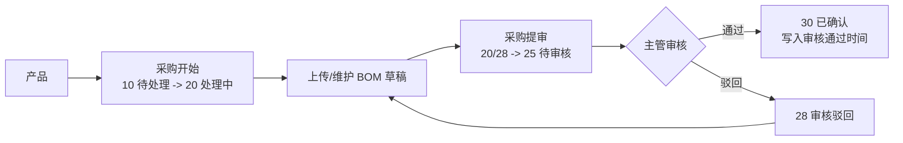

# 项目管理模块

> **会员授权 / 不随开源版源码分发：** 本页记录 Project 插件的业务规则、角色职责和页面闭环口径，公开文档站可展示规则说明，但源码或 ZIP 仍以会员授权或内部交付为准。

Project 模块覆盖产品、版本、功能点、主任务、子任务验收、任务测试用例、Bug、采购分支、钉钉通知和个人工作台。后续修改状态流、按钮入口或通知规则前，应先对照本文档和当前源码。

## 核心规则

- **数据主线**：业务层级固定为“产品 → 版本 → 功能点 → 主任务 → 当前子任务”，测试用例是主任务验收资料，不是独立流程单据。
- **提验**：开发完成某个子任务后提交给主任务验收人，子任务进入 `25 待验收`，不创建独立测试单。
- **任务测试用例**：验收资料直接归属于主任务，可通过 `task/import-cases/{id}` 导入。导入只扩充待确认范围，不代表执行结论，也不推进任务状态。
- **逐子任务验收**：`task/subtask-pass/{id}/{subtaskId}` 可以通过 `case_ids` 分批确认尚未确认的任务用例。普通节点默认不勾选用例；最后一个未通过子任务必须明确确认全部剩余用例。
- **验收授权**：`project.subtask.accept` 是子任务验收的操作授权。Project 端在当前租户内按该权限操作，System 端还需命中 System 数据范围；主任务验收人只用于“我的工作”、责任统计和通知，不构成独占授权。
- **强制闭环**：应用新建任务、草稿和 Bug 转任务固定写入 `acceptance_required=0`，客户端不能覆盖。计划日期、子任务实际及验收日期、测试用例全集和开放 Bug 门禁均通过后，主任务自动进入 `30 已完成`。
- **Bug 阻断**：未关闭或未标记非缺陷的任务级、子任务级 Bug 会阻断最终子任务验收；完全独立 Bug 不阻断任务。
- **原子回滚**：子任务验收按 Bug、主任务、全部当前子任务、任务测试用例的固定顺序加锁；任一门禁失败都不写用例结果、子任务状态、活动、通知或待办。
- **历史兼容**：`type=test`、`#Txxx` 和 `test_*` 字段只保留在数据库、活动与迁移报告中，不再提供菜单、接口、引用跳转、待办或统计，也不再形成任务撤回门禁。
- **迁移边界**：正式 `release:install/restore --install` 自动预检并转换历史 T 单或 `acceptance_required=1` 任务；来源冲突或缺少可验证 `accepted_at` 时在写库前阻断。独立迁移命令继续用于 dry-run 和幂等重跑，迁移后的 `pending` 用例仍必须在逐子任务验收中确认。
- **草稿隔离**：任务草稿只在 Project 与 System 的任务管理页可见，不进入执行、统计、提醒或闭环修复链路。

## 状态口径

| 场景 | 子任务状态 | 主任务展示 |
| --- | --- | --- |
| 未开始 | `10 待处理` | 待处理 |
| 开发中 | `20 进行中` | 进行中 |
| 已提交验收，未验收通过 | `25 待验收` | 验收中（子任务待验收） |
| 部分子任务已提验 | 部分 `25/30` | 验收中（继续提验或验收子任务） |
| 全部当前子任务已提验 | 全部 `25/30` | `25 验收中`（等待逐子任务验收） |
| 验收发现问题 | 对应子任务返工或创建 Bug | 已驳回 / 返工中，处理后重新提验 |
| 最后一个子任务验收通过 | 全部当前子任务 `30` 且都有 `accepted_at`，全部用例通过，无开放 Bug | `30 已完成` |
| 历史完成任务 | 保留历史事实 | 保留原 `30 已完成` 结论 |

主任务状态由 `ProjectTaskService::refreshOverallStatus()` 和 `summarizeSubtaskStatus()` 按当前子任务及 Bug 事实汇总，不允许通过普通编辑表单人工改成完成。全部当前子任务具备真实 `accepted_at` 后，主任务 `actual_start_at` 取最早子任务实际开始日期，`actual_finish_at` 固定取最大的子任务验收日期；历史状态 `30` 但缺少 `accepted_at` 的节点必须先修复数据。

### 任务发布状态

`project_task.publish_status` 与执行 `status` 是两套独立状态：`draft` 表示草稿，`published` 表示已发布。子任务汇总只更新执行状态和事实日期，不得覆盖发布状态；历史数据与新建普通任务默认为 `published`。

- 保存草稿时只要求标题非空，可暂缺产品、版本、功能点、负责人、验收人和子任务；发布时必须重新执行完整任务校验。
- Project 与 System 的任务管理分别使用 `task/manage-index` 和 `task/manage-info/{id}` 读取草稿；普通 `task/index`、`task/info/{id}` 以及看板、我的工作、流程、任务流、卡点、甘特、报表、引用选项和详情默认只返回 `published`。请求参数不能开启草稿读取。
- 新建表单的“保存为草稿”走 `task/draft`，“保存并发布”走原 `task/create`；`project.task.draft` 只控制新建草稿，已有草稿由创建人或具备 `project.task.update` 且命中数据范围的用户编辑、发布，不能通过普通更新接口伪造 `publish_status`。
- 草稿保存和编辑不发送通知。发布成功后才按当前开放执行周期发送一次任务指派通知并创建待办；已取消任务撤回时已转换为新周期的 `10 待处理` 草稿，重新发布会为新子任务建立待办并发送一次指派通知。重复发布同一状态不得重复建立待办或通知。
- 已发布主任务仅在执行状态为 `10 待处理`、`20 进行中` 或 `40 已取消` 时可撤回，其中 `20` 表示任务已开始且已产生执行事实。Project 应用调用人必须具备 `project.task.update`，并同时命中当前租户、ProjectAccount 数据与任务责任操作范围；System 后台调用人必须具备同一权限码，并命中当前租户与 System 数据范围，不额外要求 ProjectAccount 责任关系。仅是任务创建人但没有更新权限时不允许撤回。
- `25 验收中`、`30 已完成`、`50 已驳回` 不允许撤回为草稿；历史 T 单和旧验收活动不再阻止撤回。`10/20` 任务撤回只切换 `publish_status` 并保留原执行状态、进度、任务用例和事实日期；`40 已取消` 任务撤回则保留主任务 `Sxxx`，把原子任务和任务用例软归档，复制计划资料生成新的 `STxxx` 和新一代 `pending` 用例，并将主任务和新子任务统一重置为 `10 待处理`。两种撤回都会关闭已有待办并冻结草稿的工作流动作。
- `10/20` 撤回后已有非待处理状态、实际日期或验收日期的子任务仍属执行事实，草稿编辑不得删除或改派。`40` 重开的新周期子任务可在草稿中删除、改派或新增；旧 `STxxx` 只作为历史快照，不参与当前流程、统计、报表和提醒。Bug、评论、附件、富文本引用和活动历史继续保留，草稿管理详情通过 `collaboration` 内嵌只读协作记录。
- 取消只允许 `10/15/20/25/50` 的开放已发布主任务执行，其中 `15` 表示待补充。`30 已完成` 和 `40 已取消` 不允许再次取消，避免覆盖既有验收结论、重复记录活动或重复发送取消通知。

## 任务列表双模式

Project 与 System 的任务页共用“主任务 / 子任务”两个 Tab，默认进入主任务模式。前端以 `task_view=main|subtask` 记忆当前模式；深链带 `subtask_id` 时进入子任务模式并打开对应节点详情。

- 主任务模式保持现有整单列表、草稿管理和任务级动作；子任务模式是全部可见已发布子任务的工作台，一行一个节点，不是“仅我的任务”。
- 主任务模式继续使用 `task/manage-index` 承载草稿管理；子任务模式使用普通 `task/index` 并固定传 `subtask_node=1`。后端从现有父任务读取范围派生子任务查询并在数据库中统计、排序和分页，不把父任务全量加载后在 PHP 拆行。
- 节点模式排除草稿和归档节点。产品层级、分类、重点工作和抄送人按来源主任务筛选；状态、执行人、计划/实际/创建日期按子任务筛选；关键词同时支持父子标题/说明及 `#S`、`#ST` 编码。
- 节点按未关闭优先、计划完成日升序且空值最后、子任务 ID 降序稳定排列。当前逾期只统计状态非 `30/40` 且计划完成日早于应用当天的子任务。
- 节点行保留父任务上下文，并通过 `subtask_node_key/subtask_id/subtask` 标明当前子任务；`subtasks/my_subtasks` 只包含当前节点。按钮继续以节点 `can_*` 和写接口锁后复查为准。
- 公共筛选跨 Tab 联动；状态焦点和分页分别记忆。导出跟随当前模式，子任务模式按节点逐行输出父子编号、状态、责任人、日期、分类与重点工作。

## 任务绩效分类

任务增加两个正交的绩效事实维度，分类本身不改变任务状态、责任关系或数据范围：

| 维度 | 值 | 说明 |
| --- | --- | --- |
| 任务分类 | `department_plan`、`feedback_optimization`、`temporary` | 目标计划、反馈优化、临时任务；历史空值显示“未分类” |
| 重点工作 | `is_key_work=0/1` | 与任务分类并存，标记后进入 GS 非标准 KPI |

- 新建普通任务默认目标计划；新建并发布及草稿发布必须有分类，草稿阶段允许为空。Bug 转任务默认反馈优化并可在提交前调整。
- 历史 T 单只保留数据库快照和活动审计；当前任务绩效、报表、看板和及时率均不读取这些记录。主任务历史纠偏仍沿用 `project.task.update` 和现有操作范围并记录活动。
- 历史空分类不自动回填，不进入标准 KPI 或 GS，统一出现在“待归类任务”Sheet。
- 重点工作从目标计划完成率中排除，避免与 GS 重复统计；临时任务和反馈优化默认只进入闭环事实，标记重点工作后进入 GS。
- “目标计划”只表示工作性质，不新增部门字段或部门数据范围。
- Fresh 数据库与幂等增量迁移都包含两个字段；正式 Phar/SFX 仍通过 DBAL 安装快照升级，发布前先执行全量运行备份，不在生产包中运行迁移。

## 逾期口径

Project 全模块统一按责任节点计算逾期，任务列表、看板、甘特、任务流、流程进度、报表总览、人员及时率、闭环报表、风险报表和导出必须复用同一套规则：

- **开发逾期**：子任务 `actual_finish_at` 晚于子任务 `plan_finish_at`。
- **验收逾期**：子任务 `accepted_at` 晚于主任务 `plan_finish_at`；或子任务已进入 `25 验收中`、`accepted_at` 为空，并且当前日期已晚于主任务 `plan_finish_at`。
- **主任务逾期**：任意子任务发生验收逾期。主任务不再因为开发节点晚于子任务计划而直接算作主任务逾期。
- **当前逾期**：尚未完成且计划已过的普通节点；待验收超过主任务计划完成日必须归入验收逾期，不再降级为当前风险。
- **计划日期**：正式主任务、当前开发子任务、产品和采购/BOM 节点必须同时具备计划开始与计划完成日期；草稿仍只要求标题。Bug 的两个计划日期相互独立选填，仅在同时存在时校验顺序；无计划完成日期不计逾期或临期。
- **历史数据**：本规则只按真实业务字段计算。任务、产品和采购的历史缺失日期不通过页面继承、迁移或默认值伪造；记录可继续读取和审计，但再次正式保存或推进状态前必须人工补齐。Bug 历史空日期可继续保存、指派和流转，不需要数据修复。
- **验收时间线**：每个子任务的验收日期不得早于该子任务实际完成日，也不得晚于应用当天。已验收完成节点事后校正实际日期时仍须满足“实际开始 <= 实际完成 <= 验收日期 <= 当前日期”。

页面实时标签、统计卡、明细筛选和 Excel 导出必须保持同一结论：开发是否逾期看子任务自身完成情况，验收是否逾期看是否在主任务计划完成日前完成验收。

## KPI 与 GS 导出

Project 只导出事实、分子、分母和支撑明细，不计算 70/30 权重、绩效分、P0-P3 映射或扣分：

- 目标计划完成率按非重点目标计划的开发责任节点归责，输出应完成数、完成数和完成率。
- 反馈优化和临时任务默认只进入任务闭环明细，不形成独立标准 KPI 汇总。
- GS 只包含重点工作任务及责任节点，保留计划、实际、状态、按时和闭环证据。

Excel 保留任务节点和原始 Bug KPI 明细，并增加标准 KPI 汇总、GS 重点工作、待归类任务三个 Sheet；导出说明展示未分类数量警告。Bug 明细不受任务绩效筛选影响，也不进入本轮标准 KPI 或 GS；内部、外部 Bug 的绩效判定口径延期到定义明确后实施。

## 角色职责

| 角色 | 主要动作 |
| --- | --- |
| 管理员 | 可处理符合权限和状态的全部入口，仍受后端记录级校验限制。 |
| 产品 | 维护产品、版本、功能点和主任务计划，维护任务测试用例并协调子任务验收。 |
| 开发 | 开始子任务、提交待验收并处理 Bug 修复；最后一次提验不再创建独立验收单。 |
| 验收 | 逐个验收子任务、分批确认任务测试用例、创建和复测 Bug、标记非缺陷。内部角色码仍为 `tester`。 |
| 采购 | 处理采购待办、编辑 BOM 草稿并提交主管审核，不进入任务/Bug 主流程。 |
| 主管 | 只读查看 Project 主要业务数据，审核采购 BOM；不参与产品编辑、子任务执行验收或 Bug 处理。 |

### 角色职责节点矩阵

角色表示默认职责范围和权限模板；人员及时率以业务记录的实际责任字段为事实，按“责任类型 + 业务 ID”去重。管理员不因管理权限自动计入，但被记录字段明确指派后就正常计入该实际节点，不要求额外具备默认业务角色。角色和身份文本仅用于默认分工与治理检查，不能抹消已经形成的责任事实。

| 职责节点 | 默认角色 | 责任字段 | 主要权限 | 进入及时率 | 用于我的工作/通知待办 |
| --- | --- | --- | --- | --- | --- |
| 产品规划 | 产品 | `product.owner_account_id` / `task.owner_account_id` | `project.product.update`、`project.task.update` | 否 | 否 |
| 开发执行 | 开发 | `project_task_subtask.account_id` | `project.subtask.progress` | 是 | 我的工作、关键钉钉待办 |
| 子任务验收 | 验收 | `project_task.accept_account_id + project_task_subtask.id` | `project.subtask.accept` | 是 | 我的工作、关键钉钉待办 |
| 任务测试用例维护 | 产品、开发、验收 | `project_task.owner_account_id` / `project_task.accept_account_id` | `project.task.import-cases` | 否 | 验收资料，不形成独立责任节点 |
| Bug 修复 | 开发 | `project_bug.fixer_account_id` | `project.bug.fix` | 否 | 我的工作、关键钉钉待办 |
| Bug 复测 | 验收 | `project_bug.retest_account_id` | `project.bug.retest` | 否 | 我的工作、关键钉钉待办 |
| 非缺陷确认 | 产品、验收 | `project_bug.owner_account_id` / `project_bug.retest_account_id` | `project.bug.invalid` | 否 | 我的工作 |
| 采购执行 | 采购 | `project_product.purchase_account_id` | `project.product.purchase-start`、`project.product.bom-draft`、`project.product.bom-submit` | 否 | 我的工作 |
| 采购审核 | 主管 | `project_product.purchase_status=待审核` | `project.product.bom-review` | 否 | 我的工作 |

人员及时率只统计“开发执行、子任务验收”两类节点：开发执行按 `project_task_subtask.account_id` 归责，子任务验收按主任务 `accept_account_id` 归责。未指定责任人、账号不存在、角色或身份不匹配的节点会进入“职责异常”汇总和明细，但仍保留在实际责任节点统计中。任务测试用例不再有独立指派人，也不单独增加及时率分母；Bug 与采购当前作为待办和质量风险节点，不进入任务及时率分母。

账号拥有多个角色时，个人工作与历史统计取全部角色对应的责任类型，并按“责任类型 + 业务 ID”稳定去重。同一子任务同时承担开发执行和验收时保留为两个不同责任节点；权限临时收回后历史责任仍可只读展示，但不计入当前可操作待办和逾期风险。管理员只聚合实际分配给自己的责任节点，全局数据通过报表查看。

新增的目标计划 KPI 是独立口径：只按实际任务执行节点的 `project_task_subtask.account_id` 归责，不按岗位、角色或 `identity` 文案过滤；缺失责任账号或计划期限的节点进入绩效数据异常清单，不能从 KPI 分母中静默消失。

按钮显示统一读取后端记录级 `can_*` 字段，后端在生成能力和锁后写入时校验权限码、租户、数据范围及状态。子任务验收不再以角色名称或 `accept_account_id` 限制操作，但责任统计和通知仍按 `accept_account_id` 归集。

## 我的工作

`/project/portal` 是 Project 个人工作台，应优先让用户在当前页完成自己的待办：

- 子任务：开始执行、提交待验收、验收通过、验收不通过。
- 子任务验收：具备 `project.subtask.accept` 的人员可以逐个处理 `25 待验收` 子任务，并可分批确认任务测试用例；最后一个节点必须确认全部剩余用例。主任务验收人仍负责个人待办、责任统计和通知归集。
- Bug：开始修复、提交修复、提复测、复测通过、复测不通过、标记非缺陷。
- 采购：开始采购、编辑 BOM、采购提审、主管审核通过/驳回。

“详情”“流程”“任务管理”“Bug 管理”保留为辅助入口，用于查看完整上下文、复杂编辑和历史排查；个人处理动作不应只做成跳转。

### 逾期风险提示

“我的工作”页顶部按当前账号真正可操作的责任节点聚合风险，并与逐项标签、风险排序和明细下钻使用同一份数据。截止日早于浏览器本地当天为“已逾期”；当天到期单独标记“今日到期”；明天至第 3 个自然日标记“N 天后到期”。第 4 天及以后、历史缺失计划日期或已闭环的事项不计入当前风险。页面在本地零点和从休眠恢复时自动重算，不需要刷新接口。

- 开发子任务以子任务 `plan_finish_at` 为截止日；同一主任务下多个本人可操作子任务分别计数。
- 状态 `25` 的子任务验收以主任务 `plan_finish_at` 为责任截止日，并与子任务自身计划区间分开展示；历史父任务交付日为空时责任截止保持为空，不得回退开发子任务日期。每个本人可验收子任务分别形成一个责任节点，单纯“转派”属于管理能力，不计风险。
- 任务直属测试用例没有独立责任节点或计划区间，其确认责任跟随当前子任务验收节点使用主任务计划完成日。
- Bug 以其计划完成日为截止日，采购/BOM 以采购计划完成日为截止日，每条本人可操作待办各计 1 个责任节点。

顶部统计分别显示“已逾期责任节点数”和“临期责任节点数”，其中临期数包含今日到期以及明天至第 3 天到期的节点。门户对任务和 Bug 使用 `mine=1&portal_todo=1&portal_full=1`，采购待办使用 `portal_todo=1&portal_full=1`。有任务列表权限时，当前任务统计直接从完整任务待办派生并跳过当前 Board 请求；只有 Board 查看权而没有任务列表权限时，才调用 `board/index?mine=1&portal_todo=1` 兜底。风险抽屉在浏览器内统一排序和分页；普通并发刷新共享在途请求，动作完成后的强制刷新排队读取最新快照并阻止旧响应覆盖，翻页不会重复请求。`/system/project/portal` 继续使用 System 后台已有的租户、权限和数据范围结果。

### 任务测试用例导入

任务管理、流程和我的工作使用 `task/import-cases/{id}` 向主任务导入直属测试用例。入口以独立权限 `project.task.import-cases` 和记录级 `can_import_cases` 共同判断；验收专员仅能处理主任务验收人为本人的记录，原任务管理人员继续按任务更新权限和既有责任范围处理。模板只保留标题、步骤、预期结果和备注，新用例不再独立指派执行人。

- 模板字段固定为用例标题、操作步骤、预期结果和备注；文件不超过 5 MB，每批最多 500 条。
- 导入是原子批次，请求顶层只接受 `request_id/rows`，行内只接受模板对应的四个规范字段；任一行无效或出现额外字段时整批不提交。
- 导入前在事务锁内重新校验主任务和全部当前开发子任务的正式计划日期。前端在同一上传与重试会话中复用 `request_id`；相同任务、请求号和内容幂等返回首次结果，不重复创建用例、活动或通知。
- 用例固定写为 `pending`，只作为任务验收和重点工作闭环证据，不代表执行结论，也不自动创建 Bug 或改变任务状态。
- 发布升级通过 `project.30.task_case_import_permission.v1` 幂等补齐旧租户权限：Project 自定义配置按原任务更新/验收能力迁移，System 角色按原 `project.task.update` 或 `project.subtask.accept` 节点映射；管理员主动收窄的其它配置保持不变。

## 钉钉期限提醒

Project 任务期限提醒通过 System 调度内核注册为 `project.dingtalk.deadline-reminder`，固定归属 `project:project_app:0`，默认每天 `08:00` 执行。该计划只扫描主任务和当前责任节点；调度参数默认 `due_soon_days=3`、`limit=200`。

提醒分两类：

- `project_task_due_soon`：计划完成日期 `plan_finish_at` 在今天到未来 3 天内，默认关闭。
- `project_task_overdue`：计划完成日期早于今天，默认关闭。

是否真正发送由 Project 钉钉应用配置和钉钉消息规则共同决定。消息规则页可分别为“即将逾期提醒”和“逾期提醒”配置多个固定抄送 Project 账号；固定抄送只追加通知，不替代负责人、执行人等原接收人。固定抄送人与任务接收人重复时只发送一次并保留原职责前缀；仅固定抄送命中的人使用“仅知会”前缀。未绑定钉钉用户的固定抄送账号允许保存，发送时按现有失败日志记录；已禁用账号会在发送时跳过，不自动改写配置。

旧版外部 crontab 命令 `xadmin:project:dingtalk:remind --type=due-today/overdue` 仅作为兼容入口保留。新环境应使用 System 调度任务；如果旧 crontab 与新调度并行，今日到期与即将逾期会按“同一天同一任务同一接收人只提醒一次”去重。扫描按 `plan_finish_at`、`id` 升序处理，`limit` 命中时优先覆盖最早到期任务；期限提醒失败也会保留失败发送日志用于当天去重。调度结果中的 `sent` 兼容旧字段，语义为成功写入发送日志的接收人数；详细统计包含 `scanned_tasks`、`triggered_tasks`、`sent_receivers`、`failed_receivers`、`skipped_tasks` 和 `skipped_receivers`，其中 `skipped_tasks` 记录配置关闭、规则关闭、无接收人等任务级跳过原因，`skipped_receivers` 只记录重复提醒、固定抄送禁用等接收人级跳过原因。

## Bug 管理搜索

Bug 管理列表的“搜索内容”支持标题、描述、复测/关闭说明模糊查询，也支持按 Bug 编码精确查询；`B104`、`#B104`、`b104`、`#b104` 都表示查询 ID 为 104 的 Bug，纯数字继续作为普通关键词处理。编码查询和文本模糊查询必须在同一组条件中追加，不能因为 `OR` 条件放宽产品、版本、功能点、任务、子任务、测试用例、状态或人员筛选。

“搜索范围”是列表可见筛选项，支持同时选择版本、功能点、任务、子任务和任务测试用例，并分别提交 `version_ids`、`feature_ids`、`task_ids`、`subtask_ids`、`test_case_ids` 到 Bug 列表接口。完全独立 Bug 可以不带任何产品链路；指定任务、子任务或测试用例时由后端派生并校验同租户产品、版本和功能点。重置筛选必须清空这些范围条件。

## 主数据与任务搜索

产品、版本、功能点和任务列表的搜索内容都支持带类型前缀的主键派生编号精确查询；纯数字继续作为普通关键词处理，不会直接按 ID 命中。

- 产品：`P104`、`#P104`
- 版本：`V104`、`#V104`
- 功能点：`F104`、`#F104`
- 任务：`S104`、`#S104`

这些编码查询和文本模糊查询同样必须追加在原有筛选组内，不能放宽产品、版本、功能点、状态或人员范围。

## 采购 BOM 审核流程

采购分支独立于开发任务状态机，上传或维护 BOM 只是草稿准备，不会自动完成采购。当前标准流程为：



采购状态：

| 值 | 文案 | 说明 |
| ---: | --- | --- |
| 10 | 待处理 | 采购未开始。 |
| 20 | 处理中 | 采购专员正在维护 BOM 草稿。 |
| 25 | 待审核 | 采购已提审，等待主管审核。 |
| 28 | 审核驳回 | 主管驳回，采购专员需修改后重新提审。 |
| 30 | 已确认 | 主管审核通过，采购闭环完成。 |

历史旧“采购确认”入口已移除，不再作为业务按钮或权限码使用。存量数据通过源码期命令 `xadmin:project:purchase-bom-review:repair --dry-run|--force` 修复：默认 dry-run 只输出影响数量和样例，显式 `--force` 才写库并记录迁移活动。

采购维护是历史采购日期的唯一补录入口。父产品历史计划缺失时，只允许单独补齐采购计划；如果同一次请求改变采购状态、采购流程时间或采购实际日期，父产品 `plan_start_at/plan_finish_at` 也必须已经完整且顺序有效，不能用采购维护绕过正式产品计划门禁。

## 线上闭环修复

`xadmin:project:task-closure:repair` 用于修复历史主任务与当前子任务事实不一致的数据。它是生产运行期的必要维护命令，不使用 `SourceOnlyCommand`，因此在源码环境和包含 Project 插件的 Phar/SFX 中均可用；钉钉提醒、消息结果同步、待办刷新和失败重试同样保留在生产包。

历史验收流程切换随正式发布自动执行：`project.10.task_subtask_acceptance.v1` 转换历史验收项、取消开放 T 单、补齐可确定的 Bug 来源并关闭旧标记，`project.20.task_acceptance_closure.v1` 再按当前事实修正主任务状态。独立命令支持 `--all-tenants` 或 `--tenant-id=<租户ID>`，默认 dry-run，显式 `--force` 才在发布链之外写库。它不补造任务完成结论；迁移后遗留的 `pending` 用例必须在逐子任务验收中确认。

先从单租户、单任务和最小 `limit` 预览，确认 `items` 中的新旧状态和日期后，再在维护窗口显式追加 `--force`：

```bash
# 源码环境预览与执行
./bin/smart.php xadmin:project:task-closure:repair --tenant-id=1 --task-id=100 --limit=1 --json
./bin/smart.php xadmin:project:task-closure:repair --tenant-id=1 --task-id=100 --limit=1 --json --force

# 已发布 Phar/SFX 预览与执行
./system-linux-x64 --self xadmin:project:task-closure:repair --tenant-id=1 --task-id=100 --limit=1 --json
./system-linux-x64 --self xadmin:project:task-closure:repair --tenant-id=1 --task-id=100 --limit=1 --json --force
```

- 默认及显式 `--dry-run` 都只预览；即使内部调用传入 `dry_run=false`，没有 `force=true` 也不会写库。
- `tenant-id=0`、`task-id=0` 表示不限制对应范围，线上首次处理不得直接使用全租户大批量 `--force`；`limit` 默认 200，最小 1、最大 1000。
- 每条候选独立事务处理，按未关闭 Bug、来源主任务、全部当前子任务、任务直属测试用例的固定顺序锁定并重新检查；不再命中时计入 `skipped_after_recheck`，死锁最多重试 3 次。
- 单条最终失败记录到 `errors` 并继续后续候选，报告包含 `success`、`repaired`、`failed`、`items`；存在失败时命令返回非零退出码。
- 反向纠错可以把错误完成状态回退到当前子任务事实；前向完成必须有完整主任务和当前子任务计划日期、全部当前子任务都有真实 `accepted_at`、没有 `pending` 直属用例且没有开放 Bug。修复命令只校正汇总，不补造验收事实。
- 写入只更新主任务、层级汇总及系统修复活动，不发送钉钉通知，也不触发调度任务。执行前必须运行 `xadmin:release:backup --with-data` 保存包含 `project_task*` 的全量业务数据；默认运行备份不包含这些表。请同时保留 dry-run JSON 作为变更依据。

## 源码入口

- 状态常量：`plugin/Project/src/Support/TaskStatus.php`
- 任务/子任务验收闭环：`plugin/Project/src/Service/ProjectTaskService.php`
- 列表记录级按钮：`plugin/Project/src/Mapper/ProjectTaskMapper.php`
- Bug 闭环：`plugin/Project/src/Service/ProjectBugService.php`
- Bug 列表查询：`plugin/Project/src/Mapper/ProjectBugMapper.php`
- Bug 来源类型：`plugin/Project/src/Support/ProjectBugSourceType.php`，当前包含 `test`、`optimization`、`external`、`online`、`acceptance`、`operation`、`third_party`、`other`。
- Bug 管理页面：`plugin/Project/stc/view/bug/index.vue`
- 个人工作台：`plugin/Project/stc/view/portal/index.vue`
- 接口清单：[项目管理接口](../接口参考/项目管理接口.md)

最后更新：2026-07-15
