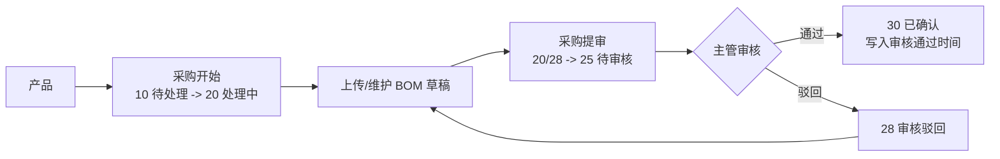

# 项目管理模块

> **会员授权 / 不随开源版源码分发：** 本页记录 Project 插件的业务规则、角色职责和页面闭环口径，公开文档站可展示规则说明，但源码或 ZIP 仍以会员授权或内部交付为准。

Project 模块覆盖产品、版本、功能点、主任务、子任务、测试单、Bug、采购分支、钉钉通知和个人工作台。后续修改状态流、按钮入口或通知规则前，应先对照本文档和当前源码。

## 核心规则

- **提验**：开发完成某个子任务后，提交给验收人确认；子任务进入 `25 待验收`，不等同于主任务提测。
- **验收通过**：验收人确认子任务完成；子任务进入 `30 已完成`。
- **提测**：所有子任务验收通过后，手动发起测试单/测试轮次；这是主任务验收闭环后的可选补充测试流程。
- **不自动提测**：最后一个子任务验收通过后，主任务汇总为 `30 已完成`，页面展示“可选提测”，但不会自动创建测试单或通知测试执行。
- **Bug 阻断**：未关闭或未标记非缺陷的 Bug 会阻断子任务、测试单或主任务进入最终闭环。

## 状态口径

| 场景 | 子任务状态 | 主任务展示 |
| --- | --- | --- |
| 未开始 | `10 待处理` | 待处理 |
| 开发中 | `20 进行中` | 进行中 |
| 已提交验收，未验收通过 | `25 待验收` | 待验收中 |
| 验收不通过 | `50 返工中` | 已驳回 / 返工中 |
| 全部子任务验收通过 | 全部 `30 已完成` | 已完成 / 可选提测 |
| 已手动提测且测试单未结束 | 测试点按测试单推进 | 测试单测试中，主任务不因提测自动回退 |

主任务状态由 `ProjectTaskService::refreshOverallStatus()` 和 `summarizeSubtaskStatus()` 汇总，不允许通过普通编辑表单人工改成完成。

## 角色职责

| 角色 | 主要动作 |
| --- | --- |
| 管理员 | 可处理符合权限和状态的全部入口，仍受后端记录级校验限制。 |
| 产品 | 维护产品、版本、功能点、主任务计划，协调验收和可选提测。 |
| 开发 | 开始子任务、提交待验收、处理 Bug 修复、具备权限时发起提测。 |
| 测试 | 验收子任务、处理测试单、创建和复测 Bug、标记非缺陷。 |
| 采购 | 处理采购待办、编辑 BOM 草稿并提交主管审核，不进入任务/Bug 主流程。 |
| 主管 | 只读查看 Project 主要业务数据，审核采购 BOM；不参与产品编辑、任务流转、测试或 Bug 处理。 |

### 角色职责节点矩阵

角色表示默认职责范围和权限模板；人员及时率采用严格归责：账号必须具备职责节点要求的业务角色，且记录责任字段指向该账号，才计入个人统计。管理员可以兜底处理，但不会因为有管理权限自动计入个人及时率，除非管理员账号同时具备对应业务角色并被记录字段明确指派。

| 职责节点 | 默认角色 | 责任字段 | 主要权限 | 进入及时率 | 用于我的工作/通知待办 |
| --- | --- | --- | --- | --- | --- |
| 产品规划 | 产品 | `product.owner_account_id` / `task.owner_account_id` | `project.product.update`、`project.task.update` | 否 | 否 |
| 任务提测 | 产品、开发 | `task.owner_account_id` / `subtask.account_id` | `project.task.submit-test` | 否 | 我的工作 |
| 开发执行 | 开发 | `project_task_subtask.account_id` | `project.subtask.progress` | 是 | 我的工作、关键钉钉待办 |
| 子任务验收 | 测试 | `project_task.accept_account_id` | `project.subtask.accept` | 是 | 我的工作、关键钉钉待办 |
| 测试验收 | 测试 | `project_task.owner_account_id` | `project.test.finish`、`project.test.reject` | 是 | 我的工作、关键钉钉待办 |
| Bug 修复 | 开发 | `project_bug.fixer_account_id` | `project.bug.fix` | 否 | 我的工作、关键钉钉待办 |
| Bug 复测 | 测试 | `project_bug.retest_account_id` | `project.bug.retest` | 否 | 我的工作、关键钉钉待办 |
| 非缺陷确认 | 产品、测试 | `project_bug.owner_account_id` / `project_bug.retest_account_id` | `project.bug.invalid` | 否 | 我的工作 |
| 采购执行 | 采购 | `project_product.purchase_account_id` | `project.product.purchase-start`、`project.product.bom-draft`、`project.product.bom-submit` | 否 | 我的工作 |
| 采购审核 | 主管 | `project_product.purchase_status=待审核` | `project.product.bom-review` | 否 | 我的工作 |

人员及时率只统计“开发执行、子任务验收、测试验收”三类节点：开发执行只认开发角色，子任务验收和测试验收只认测试角色。未指定责任人、账号不存在、角色不匹配的节点不计入个人及时率，会进入“职责异常”汇总和明细，供管理员清理错误指派。Bug 与采购当前作为待办和质量风险节点，不进入任务及时率分母。

按钮显示必须同时满足角色权限码和记录级 `can_*` 字段，后端接口仍是最终校验来源。

## 我的工作

`/project/portal` 是 Project 个人工作台，应优先让用户在当前页完成自己的待办：

- 子任务：开始执行、提交待验收、验收通过、验收不通过。
- 主任务：满足条件后显示“提测”，点击后在当前页生成测试单。
- 测试单：验收通过、验收不通过。
- Bug：开始修复、提交修复、提复测、复测通过、复测不通过、标记非缺陷。
- 采购：开始采购、编辑 BOM、采购提审、主管审核通过/驳回。

“详情”“流程”“任务管理”“Bug 管理”保留为辅助入口，用于查看完整上下文、复杂编辑和历史排查；个人处理动作不应只做成跳转。

## 采购 BOM 审核流程

采购分支独立于开发任务状态机，上传或维护 BOM 只是草稿准备，不会自动完成采购。当前标准流程为：

采购状态：

| 值 | 文案 | 说明 |
| ---: | --- | --- |
| 10 | 待处理 | 采购未开始。 |
| 20 | 处理中 | 采购专员正在维护 BOM 草稿。 |
| 25 | 待审核 | 采购已提审，等待主管审核。 |
| 28 | 审核驳回 | 主管驳回，采购专员需修改后重新提审。 |
| 30 | 已确认 | 主管审核通过，采购闭环完成。 |

历史旧“采购确认”入口已移除，不再作为业务按钮或权限码使用。存量数据通过源码期命令 `xadmin:project:purchase-bom-review:repair --dry-run|--force` 修复：默认 dry-run 只输出影响数量和样例，显式 `--force` 才写库并记录迁移活动。

## 源码入口

- 状态常量：`plugin/Project/src/Support/TaskStatus.php`
- 任务/测试闭环：`plugin/Project/src/Service/ProjectTaskService.php`
- 列表记录级按钮：`plugin/Project/src/Mapper/ProjectTaskMapper.php`
- Bug 闭环：`plugin/Project/src/Service/ProjectBugService.php`
- 个人工作台：`plugin/Project/stc/view/portal/index.vue`
- 接口清单：[项目管理接口](../接口参考/项目管理接口.md)

最后更新：2026-06-13
