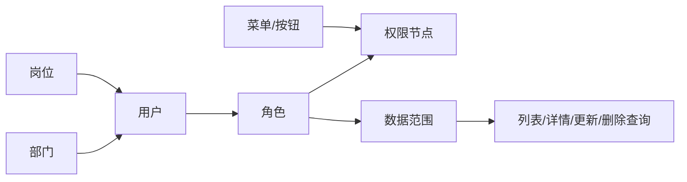

# 组织权限管理

组织权限由用户、角色、菜单、部门、岗位共同组成。建议先维护部门和岗位，再创建角色和菜单，最后创建用户并分配关系。

## 整体关系

| 对象 | 主要用途 | 影响范围 | 维护入口 |
|------|----------|----------|----------|
| 用户 | 登录主体和业务操作人 | 菜单、按钮、数据范围、操作日志归属 | `/system/user` |
| 角色 | 权限节点和数据范围集合 | 用户能访问哪些页面、按钮和数据 | `/system/role` |
| 菜单 | 前端路由、页面入口、按钮权限声明 | 左侧菜单、路由、权限码同步 | `/system/menu` |
| 部门 | 组织树和数据范围计算基础 | 本部门、部门及下级、用户列表过滤 | `/system/dept` |
| 岗位 | 用户身份标签 | 用户档案、筛选、组织展示 | `/system/post` |

## 用户管理

页面：`/system/user`

用户管理支持列表、回收站、详情、新增、编辑、删除、彻底删除、恢复、状态、排序、密码重置、角色分配、部门分配、岗位分配、前端导出和统计。

### 页面区域

- `数据列表`：展示正常用户，支持按用户名、昵称、手机号、邮箱、状态、部门等条件查询。
- `回收站`：展示软删除用户，支持恢复和彻底删除。
- `统计区`：调用用户统计接口，展示用户总量、启用/禁用、近期新增等指标。
- `操作区`：新增、编辑、删除、批量删除、重置密码、启停状态、关系分配。

### 表单字段

| 字段 | 说明 | 实现关联 |
|------|------|----------|
| `username` | 登录用户名，必须唯一 | `SystemUser` 模型字段，Service 做唯一性校验 |
| `nickname` | 显示昵称 | 用户列表和个人资料展示 |
| `password` | 初始密码或重置密码 | 写入时哈希，日志排除明文 |
| `phone` / `email` | 联系方式 | 可用于搜索和资料展示 |
| `avatar` / `signed` | 头像和签名 | 个人资料接口可更新 |
| `status` | 启用状态 | 禁用后不应继续作为有效登录主体使用 |
| `remark` | 管理备注 | 仅后台维护字段 |

### 分配关系

| 操作 | 接口 | 说明 |
|------|------|------|
| 分配角色 | `PUT /system/user/roles/{id}` | 决定用户拥有的菜单、按钮和数据范围 |
| 分配部门 | `PUT /system/user/depts/{id}` | 决定用户组织归属，也是部门数据范围计算基础 |
| 分配岗位 | `PUT /system/user/posts/{id}` | 用于岗位标签、筛选和组织信息展示 |

关键规则：

- 用户名唯一，密码字段在日志中脱敏。
- 用户列表受数据范围限制，普通角色只能看到授权范围内的数据。
- 分配角色、部门、岗位会手动记录关系变更日志，因为这些变更不一定触发模型字段事件。
- 软删除进入回收站；彻底删除会移除记录，不建议在生产环境随意操作。

## 角色管理

页面：`/system/role`

角色用于聚合权限节点和数据范围。角色授权使用 `/system/role/permission-tree` 获取可授权树，使用 `/system/role/nodes/{id}` 保存节点。

### 角色字段

| 字段 | 说明 | 推荐写法 |
|------|------|----------|
| `name` | 角色名称 | 使用业务可理解名称，例如“财务管理员” |
| `scope` | 数据范围 | 根据岗位职责选择，不用角色名称暗示数据范围 |
| `sort` | 排序 | 数值越小越靠前，保持同类角色连续 |
| `status` | 状态 | 禁用后不应继续作为有效授权来源 |
| `remark` | 备注 | 说明角色用途、授权边界、负责人 |

### 数据范围枚举

| 值 | 含义 | 适用场景 |
|----|------|----------|
| `1` | 全部数据 | 平台管理员、租户管理员等少数角色 |
| `2` | 本部门数据 | 部门主管、部门运营 |
| `3` | 本部门及下级数据 | 组织树管理、区域负责人 |
| `4` | 仅本人数据 | 普通操作员、自助入口 |

### 授权步骤

1. 创建或编辑角色基础信息，先确认角色名称和 `scope`；角色身份由系统主键维护，不再单独填写编码。
2. 打开角色授权，前端通过 `permission-tree` 获取可授权菜单和按钮。
3. 勾选页面菜单和按钮节点，保存到 `nodes/{id}`。
4. 使用被授权用户重新登录，验证菜单、按钮和数据列表范围。

关键规则：

- 不允许在创建/编辑角色时夹带权限节点，权限必须通过授权接口维护。
- 当前用户只能授予自己有权管理的节点。
- 多角色叠加时，数据范围策略以后端实现为准，前端只负责提交枚举值。
- 角色授权是高风险操作，建议在生产环境保留操作日志并限制可操作人员。

## 菜单管理

页面：`/system/menu`

菜单是前端路由、页面入口和按钮权限的基础。菜单树支持目录、菜单、按钮等类型，菜单 code 会参与权限节点同步。

### 菜单类型

| 类型 | 用途 | 关键字段 |
|------|------|----------|
| 目录 | 左侧菜单分组，不直接对应业务页面 | `name`、`route`、`icon`、`sort` |
| 菜单 | 具体页面路由 | `route`、`component`、`redirect`、`keep_alive` |
| 按钮 | 页面内操作权限 | `code`，必须与后端 `#[Auth]` 权限码一致 |

### 路由字段

| 字段 | 说明 |
|------|------|
| `pid` | 父级菜单，构成菜单树 |
| `level` | 层级，通常由服务端维护 |
| `route` | 前端访问路径，例如 `/system/user` |
| `component` | 前端组件别名；插件页面由 `plugin.json` 的 `view` 生成 `@plugin/<Module>/views/<path>.vue`，Web 内置页面可继续使用运行库内路径 |
| `redirect` | 目录或菜单默认跳转路径 |
| `link` / `iframe_src` | 外链或 iframe 菜单入口 |
| `hide_in_menu` | 不在菜单中展示，但可作为路由访问 |
| `hide_in_breadcrumb` | 不展示在面包屑 |
| `hide_in_tab` | 不加入页签 |
| `keep_alive` | 页面缓存 |
| `affix_tab` | 固定页签 |

关键规则：

- 菜单路径要与前端路由一致，例如 `/system/user`。
- 按钮权限要与后端 `#[Auth]` code 保持一致。
- 插件 `plugin.json` 菜单清单和后端注解通过 `xadmin:menu:sync`、`xadmin:node:sync` 与数据库同步。
- 新增按钮权限后，需要同步检查角色授权树是否能看到新节点。

## 部门和岗位

部门页面：`/system/dept`
岗位页面：`/system/post`

部门用于组织树和数据范围，岗位用于用户身份标签。部门删除前会检查子部门和用户占用，避免产生悬挂关系。

### 部门字段

| 字段 | 说明 |
|------|------|
| `pid` | 父级部门，根节点通常为 `0` |
| `name` | 部门名称 |
| `leader` | 负责人 |
| `phone` | 联系电话 |
| `sort` | 排序 |
| `status` | 启用状态 |
| `remark` | 备注 |

部门树会影响数据范围。如果角色数据范围是“本部门”或“本部门及下级”，后端会基于用户部门关系计算可访问的数据边界。

### 岗位字段

| 字段 | 说明 |
|------|------|
| `name` | 岗位名称 |
| `code` | 岗位编码 |
| `sort` | 排序 |
| `status` | 启用状态 |
| `remark` | 备注 |

岗位不直接决定权限，但会进入用户资料、列表筛选和组织展示。需要权限隔离时应使用角色和部门数据范围，不要依赖岗位名称。

## 建议流程

1. 创建部门树和岗位。
2. 创建菜单和按钮权限。
3. 同步菜单和权限节点。
4. 创建角色并分配权限。
5. 创建用户并分配角色、部门、岗位。
6. 使用普通用户登录验证菜单、按钮和数据范围。

## 排查清单

- 看不到菜单：检查用户是否有角色、角色是否授权菜单节点、菜单状态是否启用、前端路由是否存在。
- 按钮不可点击：检查按钮权限码是否与后端 `#[Auth]` code 一致，并确认角色已勾选按钮节点。
- 数据过少：检查角色 `scope`、用户部门关系、查询对象是否接入数据范围。
- 数据过多：检查是否给了“全部数据”角色，或新接口是否绕过了 `CoreMapper` 的数据范围保护。
- 修改后不生效：重新登录刷新前端权限缓存，必要时执行菜单/节点同步和清理缓存。

最后更新：2026-05-02
