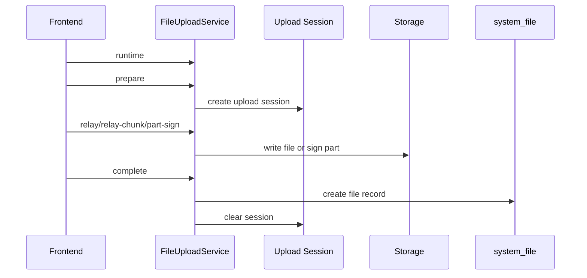

# 文件上传与存储

文件能力由 `System\FileController`、`FileService`、`FileUploadService`、`UploadConfigService` 和多种 Storage 实现组成。

## 模块职责

文件模块拆成两条线：

| 线 | 职责 | 主要实现 |
|----|------|----------|
| 文件记录 | 列表、详情、下载、编辑、删除、恢复、统计、去重 | `FileController`、`FileService` |
| 上传链路 | 上传配置、场景、运行时限制、预处理、分片、完成、终止 | `FileUploadService`、`UploadConfigService`、Storage 驱动 |

业务模块不应该直接关心 OSS、COS、Qiniu、Alist 的实现细节。推荐由上传接口生成文件记录，业务表保存文件 ID、URL 或业务自己的附件关系。

## 支持能力

- 文件记录列表、回收站、详情、下载、编辑、删除、恢复、统计。
- 上传通道配置读取和保存。
- 上传场景、运行时配置、预处理。
- 中转上传、分片中转上传、远端分片签名、完成、终止。
- 本地、OSS、COS、Qiniu、Alist 驱动。
- 基于 hash 的秒传和文件去重。

## 配置结构

上传配置由公共配置和驱动配置组成：

| 配置块 | 字段 | 说明 |
|--------|------|------|
| `active_mode` | 当前启用驱动 | 必须是系统支持的驱动 |
| `common.name_type` | 文件命名方式 | 例如 hash 命名 |
| `common.link_type` | 链接类型 | 例如完整 URL |
| `common.allow_exts` | 允许后缀 | 不能为空 |
| `common.protocol` | 链接协议 | 例如 http/https |
| `common.max_size_mb` | 最大上传体积 | 必须大于 0 |
| `common.chunk_threshold_mb` | 分块阈值 | 必须大于 0 |
| `common.multipart_threshold_mb` | 远端分片阈值 | 不能小于分片大小 |
| `common.part_size_mb` | 分片大小 | 必须大于 0 |
| `drivers.*.enabled` | 驱动是否启用 | 启用驱动必须填完整必填项 |

当前启用通道必须启用。非 local 驱动还会校验必填参数和密钥字段；密钥字段以加密字段形式保存和校验，日志中应脱敏。

## 驱动说明

| 驱动 | 适合场景 | 关键点 |
|------|----------|--------|
| local | 本地开发、单机内网部署 | `storage_path` 必须是相对 public 目录的站内路径，不能是 URL |
| alist | 已有 Alist 文件网关 | 需要 endpoint、root、public_path、token 等配置 |
| oss | 阿里云对象存储 | 需要 endpoint、bucket、region、domain 和密钥 |
| cos | 腾讯云对象存储 | 需要 bucket、region、domain 和密钥 |
| qiniu | 七牛云对象存储 | 需要 bucket、region、domain 和密钥 |

生产环境优先使用对象存储或统一文件网关。local 驱动在多实例下需要共享存储，否则不同实例可能看不到彼此上传的文件。

## 上传流程

1. 前端读取 `/system/file/upload/runtime`。
2. 前端调用 `/system/file/upload/prepare`，后端根据驱动、大小、场景决定上传方式。
3. 小文件走 `/system/file/upload/relay`。
4. 大文件可走 `/system/file/upload/relay-chunk` 或远端分片签名 `/system/file/upload/part-sign`。
5. 上传完成后调用 `/system/file/upload/complete` 生成文件记录。
6. 失败或取消时调用 `/system/file/upload/abort` 清理上传会话和临时分片。

## 小文件和大文件

| 文件类型 | 推荐路径 | 说明 |
|----------|----------|------|
| 小文件 | `relay` | 服务端中转，统一校验和落库 |
| 大文件中转 | `relay-chunk` | 分块上传到服务端，再完成合并 |
| 大文件直传 | `part-sign` + 对象存储分片 + `complete` | 前端直传对象存储，服务端负责签名和最终落库 |

是否走分块或远端分片由运行时配置、文件大小、驱动能力和前端实现共同决定。不要在前端绕过 `prepare` 自行决定对象名和存储路径。

## 配置约束

上传配置会经过 `UploadConfigValidator` 校验，避免前端直接写入不可信配置。敏感字段例如 access secret、token、key 会在操作日志中脱敏。

## 安全边界

- 文件大小、后缀、MIME、场景必须由服务端校验。
- 前端传入的文件名不能直接作为最终对象名。
- 对象存储密钥不下发给前端，前端只获取临时签名或公开访问地址。
- 下载接口需要文件管理权限；业务附件下载还需要业务数据权限。
- SVG、HTML、可执行脚本、压缩包等高风险类型需要按业务场景单独评估。
- 上传配置写操作必须记录日志，但密钥字段必须脱敏。

## 文件去重

文件去重接口会按驱动、存储路径、对象名、hash 等信息识别重复文件。去重是写操作，受 `system.file.delete` 权限保护，并记录操作日志。

去重前需要确认业务是否允许多条记录引用同一物理对象。对于已经被业务表引用的文件，不能只看文件表重复就直接删除实体文件。

## 运维检查

| 问题 | 检查点 |
|------|--------|
| 上传 413 | Nginx、PHP、前端组件、运行时上传大小限制 |
| 对象存储 403 | 密钥、Bucket、Region、Endpoint、Domain、临时签名 |
| 文件 URL 404 | object_name、storage_path、CDN 回源、公开域名 |
| 分片完成失败 | upload_id、分片数量、分片大小、缓存 TTL、临时目录 |
| 配置保存失败 | active_mode 是否启用，必填字段和密钥是否完整 |
| 多实例文件缺失 | local 驱动是否共享存储，或是否应切换对象存储 |

## 相关文档

- [文件接口](../接口参考/文件接口.md)
- [文件、公告与日志](../用户教程/文件公告日志.md)
- [缓存日志上传](../部署运维/缓存日志上传.md)

最后更新：2026-04-27
