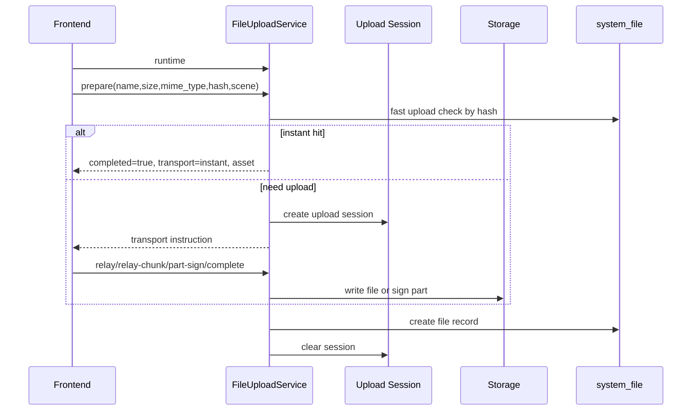

# 文件上传与存储

文件能力由 `System\FileController`、`FileService`、`FileUploadService`、`UploadConfigService` 和多种 Storage 实现组成。

## 模块职责

文件模块拆成两条线：

| 线 | 职责 | 主要实现 |
|----|------|----------|
| 文件记录 | 列表、详情、下载、编辑、删除、恢复、统计、去重 | `FileController`、`FileService` |
| 上传链路 | 上传配置、场景、运行时限制、`prepare` 秒传/签名/调度、分片、完成、终止 | `FileUploadService`、`UploadConfigService`、Storage 驱动 |

业务模块不应该直接关心 OSS、COS、Qiniu、Alist 的实现细节。推荐由上传接口生成文件记录，业务表保存文件 ID、URL 或业务自己的附件关系。

## 支持能力

- 文件记录列表、回收站、详情、下载、编辑、删除、恢复、统计。
- 上传通道配置读取和保存。
- 上传场景、运行时配置、`prepare` 秒传/签名/调度。
- 中转上传、分片中转上传、远端分片签名、完成、终止。
- 本地、OSS、COS、Qiniu、Alist 驱动。
- 基于 hash 的秒传和文件去重。

## 配置结构

上传配置是租户级配置，存储在 `system_upload_config`，按当前登录账号的 `TenantContext` 读取和保存。平台超级管理员也只维护自己登录租户的上传配置，不在上传配置页代选择其它租户。旧版全局 `system_data.config_upload` 在安装/升级修复时只迁移到默认租户 `tenant_id=1`，其它租户使用内置默认配置并由本租户管理员后续配置。

上传配置由公共配置和驱动配置组成：

| 配置块 | 字段 | 说明 |
|--------|------|------|
| `active_mode` | 当前启用驱动 | 必须是系统支持的驱动 |
| `common.name_type` | 文件命名方式 | 例如 hash 命名 |
| `common.link_type` | 链接类型 | 例如完整 URL |
| `common.allow_exts` | 允许后缀 | 不能为空 |
| `common.protocol` | 链接协议 | 例如 http/https |
| `common.max_size_mb` | 最大上传体积 | 必须大于 0 |
| `common.chunk_threshold_mb` | 分块阈值 | 必须大于 0 |
| `common.multipart_threshold_mb` | 远端分片阈值 | 不能小于分片大小 |
| `common.part_size_mb` | 分片大小 | 必须大于 0 |
| `drivers.*.enabled` | 驱动是否启用 | 启用驱动必须填完整必填项 |

当前启用通道必须启用。非 local 驱动还会校验必填参数和密钥字段；密钥字段以加密字段形式保存和校验，日志中应脱敏。

## 驱动说明

| 驱动 | 适合场景 | 关键点 |
|------|----------|--------|
| local | 本地开发、单机内网部署 | `storage_path` 必须是相对 public 目录的站内路径，不能是 URL |
| alist | 已有 Alist 文件网关 | 需要 endpoint、root、public_path、token 等配置 |
| oss | 阿里云对象存储 | 需要 endpoint、bucket、region、domain 和密钥 |
| cos | 腾讯云对象存储 | 需要 bucket、region、domain 和密钥 |
| qiniu | 七牛云对象存储 | 需要 bucket、region、domain 和密钥 |

生产环境优先使用对象存储或统一文件网关。local 驱动在多实例下需要共享存储，否则不同实例可能看不到彼此上传的文件。

## 上传流程

1. 前端读取 `/system/file/upload/runtime`。
2. 前端调用 `/system/file/upload/prepare`，请求必须包含 `name`、`size`、`mime_type`、`hash` 和 `mode/scene`；这一步就是第一次签名/调度入口，后端先校验权限与元数据，再按 hash 秒传检查。
3. 秒传命中时直接返回 `completed=true`、`transport=instant` 和文件记录，前端不再上传二进制内容。
4. 未秒传时，后端按驱动能力和文件大小返回 `direct-single`、`direct-multipart`、`relay-single` 或 `relay-chunk`，前端只执行返回的 `transport`、`method`、`upload_url`、`headers`、`form_fields`、`part_size` 等指令；`upload_type` 仅允许空值、`direct`、`relay`。
5. OSS/COS/Qiniu 走后端签名后浏览器直传；当前只有 OSS 大文件会走 `direct-multipart`。local、AList 或不支持直传的通道走后端中转。
6. 中转上传按服务端请求体上限自动选择 `/system/file/upload/relay` 或 `/system/file/upload/relay-chunk`，超过单次请求限制的文件不会再整包 relay。
7. 直传成功后调用 `/system/file/upload/complete` 生成文件记录；中转上传由 relay 接口在写入存储后返回文件记录。
8. 失败或取消时调用 `/system/file/upload/abort` 清理上传会话和临时分片；直传失败需要终止当前会话，再重新 `prepare` 获取后端明确的 fallback 指令。

```mermaid
sequenceDiagram
  participant Web as Frontend
  participant API as FileUploadService
  participant Cache as Upload Session
  participant Store as Storage
  participant DB as system_file

  Web->>API: runtime
  Web->>API: prepare(name,size,mime_type,hash,scene)
  API->>DB: fast upload check by hash
  alt instant hit
    API-->>Web: completed=true, transport=instant, asset
  else need upload
    API->>Cache: create upload session
    API-->>Web: transport instruction
    Web->>API: relay/relay-chunk/part-sign/complete
    API->>Store: write file or sign part
  end
  API->>DB: create file record
  API->>Cache: clear session
```

## 小文件和大文件

| 上传方式 | 适用场景 | 说明 |
|----------|----------|------|
| `instant` | hash 秒传命中 | `prepare` 直接返回文件记录，不创建上传会话 |
| `relay-single` | local/AList 小文件或显式中转小文件 | 服务端中转，统一校验和落库 |
| `relay-chunk` | local/AList 大文件或超过单次请求体上限的中转文件 | 分块上传到服务端，再完成合并 |
| `direct-single` | OSS/COS/Qiniu 小文件直传 | 后端返回临时签名，前端直传对象存储后调用 `complete` |
| `direct-multipart` | OSS 大文件直传 | 前端逐片请求 `part-sign` 并上传对象存储，最后调用 `complete` |

是否走分块或远端分片由后端 `prepare` 根据运行时配置、文件大小、驱动能力和 Swoole 请求体上限共同决定。不要在前端绕过 `prepare` 自行决定对象名、存储路径或中转方式。

`relay-chunk` 会校验 `chunk_index` 不超过 `total_chunks` 和会话 `part_count`，`total_chunks` 必须等于 `part_count`，非最后一块不能超过会话 `part_size`；最后一块到达后服务端合并临时分块，并通过存储驱动的路径写入能力落库，避免把大文件整包读入 PHP 内存。`direct-multipart` 的 `complete.parts` 必须数量等于 `part_count`，`part_number` 覆盖 `1..part_count` 且不可重复，`etag` 不能为空。

## 前端封装

业务页面、富文本和文件选择器统一使用 `@vben/common-ui` 的上传组件或公共方法：

- `AdminUploadField`、`AdminImageUpload`、`AdminFileUpload`、`AdminVideoUpload`
- `uploadFile(file, options)`、`uploadSceneFile(scene, file, options)`
- `resolveUploadAccept(runtime, scene)`、`UploadTransport`、`UploadPreference`、`UploadFileOptions`

页面层只传场景、驱动偏好、进度回调等业务参数，不判断 OSS、COS、Qiniu、local、AList，也不自行决定大文件整包中转或分片方式。前端公共上传器会先计算 MD5，调用 `prepare`，运行时校验 `transport`，并在直传失败时先 `abort` 当前会话，再重新 `prepare(upload_type=relay)` 获取后端明确的 fallback 指令。

## 配置约束

上传配置会经过 `UploadConfigValidator` 校验，避免前端直接写入不可信配置。敏感字段例如 access secret、token、key 会在操作日志中脱敏。读取或保存配置时必须已经建立有效租户上下文，解析不到 `tenant_id > 0` 时直接失败，不能回退到全局配置或数据库默认值。

## 安全边界

- 文件大小、后缀、MIME、场景必须由服务端校验。
- 前端传入的文件名不能直接作为最终对象名。
- 对象存储密钥不下发给前端，前端只获取临时签名或公开访问地址。
- 下载接口需要文件管理权限；业务附件下载还需要业务数据权限。
- SVG、HTML、可执行脚本、压缩包等高风险类型需要按业务场景单独评估。
- 上传配置写操作必须记录日志，但密钥字段必须脱敏。

## 文件去重

文件去重接口会按驱动、存储路径、对象名、hash 等信息识别重复文件。去重是写操作，受 `system.file.delete` 权限保护，并记录操作日志。

去重前需要确认业务是否允许多条记录引用同一物理对象。对于已经被业务表引用的文件，不能只看文件表重复就直接删除实体文件。

## 运维检查

| 问题 | 检查点 |
|------|--------|
| 上传 413 | Nginx、Swoole `package_max_length`、前端组件、运行时上传大小限制；中转大文件应确认 `prepare` 返回 `relay-chunk` |
| 对象存储 403 | 密钥、Bucket、Region、Endpoint、Domain、临时签名 |
| 文件 URL 404 | object_name、storage_path、CDN 回源、公开域名 |
| 分片完成失败 | upload_session_id、对象存储 upload_id、`parts` 数量、part_number 覆盖范围、ETag、缓存 TTL、临时目录 |
| 配置保存失败 | active_mode 是否启用，必填字段和密钥是否完整 |
| 多实例文件缺失 | local 驱动是否共享存储，或是否应切换对象存储 |

## 相关文档

- [文件接口](../接口参考/文件接口.md)
- [文件、公告与日志](../用户教程/文件公告日志.md)
- [缓存日志上传](../部署运维/缓存日志上传.md)

最后更新：2026-06-21
