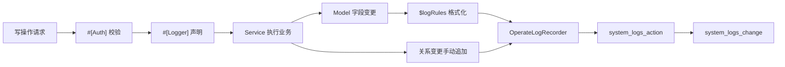
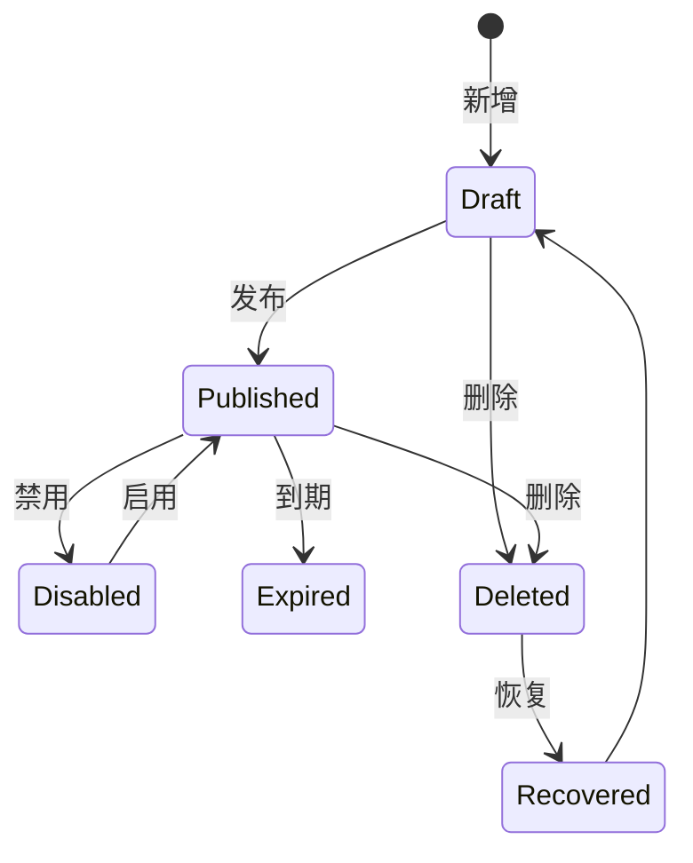

# 日志审计与公告

日志和公告是后台系统的运行支撑能力：日志负责“发生了什么、谁做的、改了什么”，公告负责“通知谁、是否已读、是否归档”。两者都和权限、用户、租户、数据范围密切相关。

## 操作日志

操作日志由 `#[Logger]` 注解、`LoggerAspect`、`OperateLogRecorder` 和 `LoggerListener` 协作完成。写操作必须声明日志注解，敏感字段通过 `excludeFields` 和全局脱敏规则过滤。

操作日志主体：

- `request_data`：请求参数。
- `response_data`：响应摘要。

变更日志主体：

- `action_id`：关联操作日志。
- `change_values`：字段变化明细。
- `change_remark`：业务可读变更描述。

## 审计链路

写操作的审计不只记录“接口被调用”，还应尽可能记录“关键字段从什么值变成什么值”。对于用户角色、角色节点、公告接收人等关系数据，Service 需要手动追加变更记录。

## 日志字段语义

| 字段 | 说明 |
|------|------|
| `username` | 操作人 |
| `method` | HTTP 方法 |
| `router` | 请求路由 |
| `name` | 操作名称，通常来自 `#[Logger]` |
| `remark` | 操作备注 |
| `ip` / `ip_location` | 请求 IP 和归属地 |
| `os` / `browser` | 客户端环境 |
| `request_data` | 请求数据，按规则脱敏和截断 |
| `response_code` | 响应业务码 |
| `response_data` | 响应摘要，按规则脱敏和截断 |

变更日志字段补充：

| 字段 | 说明 |
|------|------|
| `action_id` | 关联操作日志 ID |
| `model` / `table_name` | 业务模型与业务表 |
| `record_id` / `record_label` | 业务记录 ID 和展示名 |
| `event` | `created`、`updated`、`deleted`、`force_deleted`、`restored` |
| `change_values` | 字段或关系变更明细 |
| `change_remark` | 可读变更摘要 |

## 请求日志

`LogsMiddleware` 记录请求基础信息，包含接口、用户、IP、浏览器、设备、耗时、状态以及请求/响应 body 预览。body 超过内置长度限制时使用 `...` 截断，并在入库前脱敏。

请求日志主要用于定位请求是否到达、响应码是什么、耗时是否异常。操作日志主要用于审计写操作，两者关注点不同。

## 日志管理

`LogsActionController` 提供操作日志列表、详情、清空、统计、分析报告和近实时指标。`LogsChangeController` 提供变更日志列表、详情和操作关联变更明细。前端页面分别位于 `/system/logs/action` 和 `/system/logs/change`。

### 日志维护能力

| 能力 | 说明 | 风险 |
|------|------|------|
| 列表/详情 | 查询日志和变更详情 | 需要权限和数据范围 |
| 统计/指标 | 展示数量、趋势、失败率等 | 不应泄露越权数据 |
| 分析报告 | 聚合高频失败、热门路由、异常趋势 | 大数据量下注意性能 |
| 关联回看 | 从操作日志详情查看同一次操作产生的变更 | action 权限需要与 change 数据范围一致 |
| 清空 | 删除大量日志 | 高风险，限制权限 |

### 脱敏要求

以下内容不得明文入库：

- 密码、旧密码、新密码。
- Token、Authorization、Cookie。
- Secret、Key、AccessKey、SecretKey。
- 上传签名、临时凭证。
- 其他业务敏感字段。

脱敏规则要支持点路径，例如 `drivers.oss.access_secret`。记录大 JSON body 时只保留限制长度内的预览，超出部分使用 `...` 截断，并在写入前脱敏。

## 通知中心

通知中心由 `NoticeController` 和 `NoticeService` 提供，支持管理端公告和用户收件箱：

- 管理端：新增、编辑、删除、恢复、彻底删除、发布、状态。
- 用户端：收件箱、未读数、标记已读、全部已读、归档、全部归档。

公告收件人是关系数据，变更需要显式记录日志，不能只依赖模型字段事件。

## 公告生命周期

公告主记录和用户收件记录是两个层次：

| 层次 | 说明 |
|------|------|
| 公告主记录 | 标题、内容、级别、状态、发布时间、过期时间、链接 |
| 用户收件记录 | 当前用户是否已读、是否归档、读取时间 |

管理员发布公告后，服务端生成用户维度接收记录。用户标记已读或归档只影响自己的收件记录，不影响公告主记录。

## 公告权限

| 场景 | 权限 |
|------|------|
| 公告管理列表、新增、编辑、发布、删除 | 需要公告管理权限 |
| 我的收件箱、未读数、已读、归档 | 只要求登录态 |

不要把收件箱接口做成公告管理权限，否则普通用户无法读取自己的通知。

## 运维和排查

| 问题 | 检查点 |
|------|--------|
| 写操作没有日志 | 是否加 `#[Logger]`，是否走标准响应链路 |
| 字段变更不可读 | Model 是否配置 `$logRules`、枚举 values、unit |
| 关系变更没有记录 | Service 是否手动追加变更日志 |
| 日志表太大 | 是否配置归档和过期清理 |
| 公告未收到 | 是否已发布，接收人关系是否生成 |
| 未读数异常 | 收件记录是否正确，是否已读或归档 |

## 相关文档

- [日志公告接口](../接口参考/日志公告接口.md)
- [文件、公告与日志](../用户教程/文件公告日志.md)
- [缓存日志上传](../部署运维/缓存日志上传.md)

最后更新：2026-04-29
