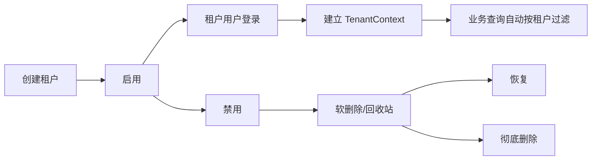

# 租户与发布构建

租户、发布快照和 Phar 构建解决的是私有化交付和多租户运行中的三个问题：运行时隔离、数据库升级可控、发布产物可复制。

## 多租户

租户能力已合入 `plugin/System`，提供租户 CRUD、状态和统计；列表导出由前端复用分页列表接口生成。租户菜单由 `plugin/System/plugin.json` 声明，跟随插件菜单清单统一同步。

普通业务表如果包含 `tenant_id` 且模型 `$fillable` 包含该字段，会触发 `CoreModel` 租户范围。用户登录后 `UserService` 会建立 `TenantContext`，普通查询按当前租户过滤。

## 租户上下文

`TenantContext` 基于 Hyperf 协程上下文保存当前租户 ID：

| 方法 | 说明 |
|------|------|
| `TenantContext::set($tenantId)` | 写入当前协程租户 |
| `TenantContext::get()` | 获取当前租户，默认平台租户 ID 为 `0` |
| `TenantContext::has()` | 判断当前协程是否有租户上下文 |
| `TenantContext::clear()` | 清理为平台租户 ID |
| `TenantContext::isPlatform()` | 判断是否平台空间 |

登录、刷新登录态和用户信息读取会建立或清理租户上下文。Swoole 环境下不要把租户 ID 存在单例 Service 属性中，必须依赖协程上下文或方法参数。

## 租户接入规则

| 对象 | 要求 |
|------|------|
| 表结构 | 支持租户隔离的业务表必须包含 `tenant_id` |
| Model | `$fillable` 必须包含 `tenant_id` 才能接入通用租户范围 |
| 查询 | 普通查询优先走 `CoreMapper` 和 `CoreModel` |
| 超级管理员 | 必须显式判断，不用 `tenant_id = 0` 作为隐式业务兜底 |
| 数据范围 | 租户隔离和角色数据范围同时生效，不互相替代 |

平台侧租户管理接口用于维护租户资料，不代表普通业务接口可以手工指定租户 ID 查询其他租户数据。

## 租户生命周期

彻底删除租户是高风险操作。执行前需要确认租户用户、业务数据、上传文件、日志和备份策略。

## 发布快照

发布升级不依赖迁移文件在生产环境逐条执行，而是通过 DBAL 快照比较结构和数据：

- `xadmin:release:backup` 生成 `runtime/release/database.schema.gz` 和 `runtime/release/database.data.gz`。
- `xadmin:release:upgrade --dry-run` 输出升级 SQL 和影响范围。
- `xadmin:release:upgrade --force` 允许破坏性结构同步。
- `xadmin:release:restore --backup=<id>` 从备份恢复受管表。

配置位于 `config/autoload/release.php`，只允许使用 `backup_tables` 和 `ignore_tables` 控制发布系统维护的数据表。

当前配置示例：

| 配置 | 当前表 | 含义 |
|------|--------|------|
| `backup_tables` | `system_menu` | 发布包接管菜单基线，升级前备份，升级时按快照替换 |
| `ignore_tables` | `system_logs_action`、`system_logs_change` | 发布系统完全不维护这些运行数据 |

### 发布数据分类

| 类型 | 示例 | 发布系统处理 |
|------|------|--------------|
| 结构快照 | 表、字段、索引 | DBAL diff |
| 受管数据 | 菜单基线等 | `backup_tables` 接管 |
| 运行数据 | 日志、文件记录、公告收件记录 | `ignore_tables` 跳过 |
| 业务数据 | 客户、订单、租户业务表 | 通常不应由发布包清空替换 |

`ignore_tables` 优先级高于 `backup_tables`。修改 release 配置后必须执行 dry-run，确认影响表。

## 升级边界

默认升级只执行非破坏性结构同步；破坏性结构同步必须显式使用 `--force`。发布系统能降低风险，但不能替代评审：

- drop/rename/change type/truncate 等操作必须人工确认。
- 上传文件和对象存储不在数据库 restore 范围内。
- `.env` 和 runtime 目录需要独立备份。
- 多实例发布要确认所有实例使用同一版本代码和配置。

## Phar 打包

`zoujingli/smart-admin-builder` 提供 `xadmin:build:phar`，`composer build` 会委托 `.php-sfx-packer.php build` 复用并校验已有 `web/dist`，再执行菜单/节点同步、生产依赖安装、发布快照、容器缓存预编译、Phar 打包、SFX 合并、构建审计和开发依赖恢复。前端产物需先通过 `composer web:build` 或 CI 等价步骤生成，不提交到 Git。

打包后目标是单文件运行：后端、前端资源压缩包和必要依赖进入二进制，运行目录保留 `.env` 和发布快照。

## 构建链路

预编译阶段会生成 `runtime/container/scan.cache`、`classes.cache`、`aspects.cache` 和 `build.manifest.json`，用于把 Hyperf 容器扫描结果直接打入发布包，减少二进制首次启动的动态扫描成本。

Phar 命令支持 `name`、`bin`、`path`、`phar-version`、`mount` 等参数。构建前需要确认 `phar.readonly` 允许写入，且项目依赖已经安装。SFX 产物执行应用命令时统一使用 `<binary> --self <command>`，例如 `./build/system-macos-a64 --self start`。

前端资源不再以 raw `web/dist` 目录进入 Phar，而是压缩为 `storage/extra/web-dist.zip`。首次 `start` 且 `public/index.html` 缺失时会自动发布，也可以执行 `<binary> --self xadmin:site:publish` 手动发布；`_app.config.js` 始终由运行环境动态生成，不随 zip 覆盖。

内置 Swoole 基库为精简 PHP 8.4 + Swoole 6.2 SFX 运行时；如需自定义扩展或重新构建，可参考 [zoujingli/phpsfx](https://github.com/zoujingli/phpsfx)。仓库不内置 `tools/phpsfx/`，构建审计只校验已交付的 `bin/swoole-*`。

## 运行目录

Phar 模式下需要关注：

| 文件/目录 | 说明 |
|-----------|------|
| `.env` | 运行配置，不打入 Phar |
| `runtime/release` | 发布快照和升级备份，位于二进制同级运行目录 |
| `public` | 前端静态资源发布目录，由 `storage/extra/web-dist.zip` 按需生成 |
| `runtime/logger` | 运行日志 |
| 上传目录 | local 驱动文件实体 |
| 对象存储配置 | 通过 `.env` 或系统配置维护，密钥不写入前端 |

## 常见问题

| 问题 | 检查 |
|------|------|
| 租户数据串读 | 表是否有 `tenant_id`，Model `$fillable` 是否包含该字段 |
| 平台管理员误看业务数据 | 是否显式判断超级管理员和平台空间 |
| dry-run 输出会删除表 | 检查 `ignore_tables` 和快照来源 |
| restore 后数据不完整 | restore 只恢复备份包含的受管表 |
| Phar 无法构建 | 检查 `phar.readonly`、vendor 是否安装、构建路径是否正确 |
| Phar 找不到快照 | 确认 `runtime/release` 在二进制同级运行目录 |
| Phar 前端入口缺失 | 执行 `<binary> --self xadmin:site:publish --dry-run` 检查 `web-dist.zip` |
| 二进制执行未进入应用命令 | 使用 `<binary> --self <command>`，不要直接执行 `<binary> start` |

## 相关文档

- [租户接口](../接口参考/租户接口.md)
- [发布升级](../部署运维/发布升级.md)
- [生产部署](../部署运维/生产部署.md)

最后更新：2026-05-18
