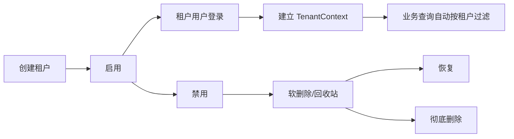
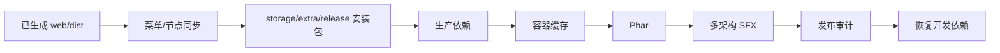

# 租户与发布构建

租户、release 安装包、运行备份和 Phar 构建解决的是私有化交付和多租户运行中的三个问题：运行时隔离、数据库升级可控、发布产物可复制。

## 多租户

租户能力已合入 `plugin/System`，提供租户 CRUD、状态和统计；列表导出由前端复用分页列表接口生成。租户菜单由 `plugin/System/plugin.json` 声明，跟随插件菜单清单统一同步。

普通业务表如果包含 `tenant_id` 且模型 `$fillable` 包含该字段，会触发 `CoreModel` 租户范围。用户登录后 `UserService` 会建立 `TenantContext`，普通查询按当前租户过滤。

数据库字段 `tenant_id` 的默认值可以保留为 `0`，用于兼容历史表结构和暴露异常数据；但普通业务表中的 `0` 只表示未归属、未建立上下文或待修复旧数据，不是平台租户，也不是业务默认租户。正常业务数据必须在写入前解析出 `tenant_id > 0`，固定默认租户为 `system_tenant.id = 1`。

审计日志表 `system_logs_action` 是唯一保留 `tenant_id=0` 的租户表例外。它用于记录平台级或无可信租户来源的操作日志；能解析到登录用户、插件账号、站点、应用或回调租户时仍必须写真实租户。平台 0 日志只对 `APP_SUPER_USER` 平台超级管理员可见，租户用户和 SaaS 子超管只能查看本租户日志。变更明细表 `system_logs_change` 不写平台 0 明细，只跟随真实租户操作日志记录业务字段变化。

## 租户上下文

`TenantContext` 基于 Hyperf 协程上下文保存当前租户 ID：

| 方法 | 说明 |
|------|------|
| `TenantContext::set($tenantId)` | 写入当前协程租户 |
| `TenantContext::get()` | 获取当前租户；未建立上下文时返回哨兵值 `0` |
| `TenantContext::has()` | 判断当前协程是否存在有效租户上下文，只有 `tenant_id > 0` 才返回 true |
| `TenantContext::requireTenantId()` | 读取当前有效租户；无效时抛业务异常，普通业务写入应使用它而不是回退到 `0` |
| `TenantContext::clear()` | 销毁当前协程租户上下文和显式写入标记，清理后不保留 `tenant_id=0` |
| `TenantContext::isPlatform()` | 判断当前账号是否为 `APP_SUPER_USER` 平台超级管理员 |
| `TenantContext::withTenant($tenantId, $callback)` | 在已校验来源的开放接口、回调或任务中临时恢复 `tenant_id > 0` 的租户上下文 |
| `TenantContext::withExplicitTenantWrite($callback)` | 在平台代维护、租户开通等显式入口临时允许写入目标租户 |

登录、刷新登录态和用户信息读取会建立或清理租户上下文。Swoole 环境下不要把租户 ID 存在单例 Service 属性中，必须依赖协程上下文或方法参数。

## 租户接入规则

| 对象 | 要求 |
|------|------|
| 表结构 | 支持租户隔离的业务表必须包含 `tenant_id` |
| Model | `$fillable` 必须包含 `tenant_id` 才能接入通用租户范围 |
| 查询 | 普通查询优先走 `CoreMapper` 和 `CoreModel`；普通搜索白名单不得接受请求 `tenant_id`；无有效租户上下文时默认 fail closed |
| 写入 | 普通 `filterData()` 先忽略请求 `tenant_id`，创建时用 `TenantContext::requireTenantId()` 写当前租户；最终落库前必须明确得到 `tenant_id > 0`，不得依赖数据库默认值 `0` |
| 超级管理员 | 必须显式判断，不用 `tenant_id = 0` 作为隐式业务兜底 |
| SaaS 子超管 | `system_user.super = 1`，只在所属租户内自动拥有非平台保留权限 |
| 数据范围 | 租户隔离和角色数据范围同时生效，不互相替代 |

平台侧租户管理接口用于维护租户资料，不代表普通业务接口可以手工指定租户 ID 查询其他租户数据。

### 默认租户 1

`system_tenant.id = 1` 是固定默认租户。它是安装、升级和历史数据修复使用的真实业务租户，不是匿名访问兜底，也不代表平台空间。安装或升级时如果默认租户缺失、被软删、被禁用或到期字段异常，系统会恢复为可用状态。

默认租户具备以下保护：

- 永不过期，`expired_at` 固定恢复为空。
- 不可禁用、不可删除、不可彻底删除。
- 只能修改联系人、联系电话、联系邮箱和备注等资料字段。
- 新增种子数据、演示数据和初始化数据必须显式写入 `tenant_id = 1`，不能依赖字段默认值。

### 历史数据修复

安装、升级和发布恢复会执行 `TenantRepairService`：

1. 检查并恢复默认租户 `system_tenant.id = 1`。
2. 补齐升级库中的 `system_user.super` 字段。
3. 扫描所有包含 `tenant_id` 字段的业务租户表。
4. 将业务表中 `tenant_id is null` 或 `tenant_id <= 0` 的历史数据批量修复为 `1`；`system_logs_action.tenant_id=0` 作为平台日志诊断保留，不参与修复，变更日志 `system_logs_change` 仍只允许跟随真实租户日志写入。
5. 为缺失 SaaS 子超管的租户选择一个启用用户补齐 `super=1`，优先选择“租户管理员”角色下的用户，排除 `APP_SUPER_USER` 平台超级管理员。

修复过程幂等，可重复执行。人工预览可使用：

```bash
./bin/smart.php xadmin:tenant:repair --dry-run --json
```

安装和升级路径必须真实执行修复，不以 dry-run 代替。原生 SQL、批量插入和关系表写入也必须显式写入 `tenant_id > 0`；仅操作日志在无可信租户来源时允许记录平台 0 日志。

上传通道配置属于租户级配置，安装/升级会确保 `system_upload_config` 表存在，并且只把旧版全局 `system_data.config_upload` 复制给默认租户 `tenant_id=1`。其它租户不会继承旧全局配置，首次读取使用内置默认配置，后续由本租户子超管或具备 `system.file.upload-config` 权限的管理员自行维护。

### SaaS 子超管

新租户开通时，系统自动创建默认部门、租户管理员角色和管理员账号，管理员账号会写入 `super=1`。子超管在本租户内拥有全部非平台保留权限，仍受租户上下文隔离；平台保留权限包括 `system.tenant.*`、`system.menu.*`、`system.setting.*`、`system.data.*`，以及跨租户用户代维护能力。

只有 `APP_SUPER_USER` 平台超级管理员可以在用户管理中查看、设置或取消用户 `super` 状态。租户子超管可以管理本租户普通用户，但不能修改任何人的子超管状态，不能操作其他子超管账号，也不能跨租户查看或维护用户。

## 租户生命周期


```mermaid
flowchart LR
  Create["创建租户"] --> Enable["启用"]
  Enable --> Login["租户用户登录"]
  Login --> Context["建立 TenantContext"]
  Context --> Query["业务查询自动按租户过滤"]
  Enable --> Disable["禁用"]
  Disable --> Recycle["软删除/回收站"]
  Recycle --> Restore["恢复"]
  Recycle --> RealDelete["彻底删除"]
```

彻底删除租户是高风险操作。系统会先扫描所有业务租户表；只要发现该租户仍有数据，就拒绝硬删并返回命中的表和行数摘要。操作审计表 `system_logs_action`、`system_logs_change` 不作为业务数据硬删阻断条件，默认租户 `1` 仍禁止禁用、软删和硬删。

## release 安装包与运行备份

发布安装与升级不依赖迁移文件在生产环境逐条执行，而是通过 DBAL 快照恢复结构和数据：

- `composer release:backup` 在 fresh SQLite/MySQL 临时库生成格式版本 2 安装包：`database.schema.sqlite.gz`、`database.schema.mysql.gz`、`database.data.gz`、`database.meta.json`。元数据记录双方言结构与共享数据的 SHA-256。
- `xadmin:release:restore --install --dry-run` 输出安装包恢复 SQL 和必要数据表。
- `xadmin:release:backup` 默认生成运行备份到 `runtime/backup/<timestamp>/`，只包含结构和必要数据。
- `xadmin:release:backup --with-data` 生成运行全量备份，包含结构和全部数据。
- `xadmin:release:restore` 默认恢复最新运行备份的结构和必要数据；`--with-data` 恢复最新全量运行备份。

安装包先写入本批 `storage/extra/release.staging-<token>`，双方言结构捕获和 SQLite/MySQL 目标恢复验证全部成功后才原子发布正式目录；新批次开始时旧 final 立即失效，失败后 final 保持缺失，避免误打包上一轮快照。旧单 schema 安装包和摘要不匹配会被拒绝；当前 `DB_PREFIX` 会贯穿双方言源库与目标库，低层守卫按去除前缀后的逻辑表名识别备份副本表。运行备份继续使用 `database.schema.gz` 单方言格式，不受安装包格式升级影响。

配置位于 `config/autoload/release.php`，只允许使用 `backup_tables` 和 `ignore_tables` 控制必要数据表。

当前配置示例：

| 配置 | 当前表 | 含义 |
|------|--------|------|
| `backup_tables` | `system_menu` | 发布包必要菜单基线数据，不加 `--with-data` 时会备份和恢复 |
| `ignore_tables` | `system_logs_action`、`system_logs_change` | 不进入必要数据；优先级高于 `backup_tables` |

### 发布数据分类

| 类型 | 示例 | 发布系统处理 |
|------|------|--------------|
| 结构快照 | 表、字段、索引 | 所有当前表结构进入 DBAL 快照 |
| 必要数据 | 菜单基线等 | `backup_tables` 接管 |
| 运行数据 | 日志、文件记录、公告收件记录 | 默认不进入必要数据，`--with-data` 才进入运行全量备份 |
| 业务数据 | 客户、订单、租户业务表 | 通常不应由发布包清空替换，需要通过运行备份保护 |

`ignore_tables` 优先级高于 `backup_tables`。修改 release 配置后必须执行 dry-run，确认影响表。

## 升级边界

历史发布升级专用命令已删除，正式发布升级统一使用 `xadmin:release:restore --install`。发布二进制不注册 migrate、插件管理、构建、docs 等源码命令；必要业务运行命令若保留在插件内，必须单独说明用途和风险。默认不允许执行破坏性结构 SQL；破坏性结构同步必须显式使用 `--force`。发布系统能降低风险，但不能替代评审：

- drop/rename/change type/truncate 等操作必须人工确认。
- 上传文件和对象存储不在数据库 restore 范围内。
- `.env`、runtime 目录和上传文件需要独立备份。
- 多实例发布要确认所有实例使用同一版本代码和配置。

## Phar 打包

`zoujingli/smart-admin-builder` 提供 `xadmin:build:phar`，`composer build` 会委托 `.php-sfx-packer.php build` 复用并校验已有 `web/dist`，再执行 fresh 双库迁移、菜单/节点同步、双方言 release 安装包生成与恢复验证、生产依赖安装、容器缓存预编译、Phar 打包、SFX 合并、构建审计和开发依赖恢复。前端产物需先通过 `composer web:build` 或 CI 等价步骤生成，不提交到 Git。

打包后目标是单文件运行：后端、前端资源压缩包、数据库安装包和必要依赖进入二进制，运行目录保留 `.env`、runtime、上传文件和运行备份。

## 构建链路


```mermaid
flowchart LR
  Web["已生成 web/dist"] --> Sync["菜单/节点同步"]
  Sync --> Snapshot["storage/extra/release 安装包"]
  Snapshot --> Prod["生产依赖"]
  Prod --> Precompile["容器缓存"]
  Precompile --> Phar["Phar"]
  Phar --> Sfx["多架构 SFX"]
  Sfx --> Audit["发布审计"]
  Audit --> Restore["恢复开发依赖"]
```

预编译阶段会生成 `runtime/container/scan.cache`、`classes.cache`、`aspects.cache` 和 `build.manifest.json`，用于把 Hyperf 容器扫描结果直接打入发布包，减少二进制首次启动的动态扫描成本。

Phar 命令支持 `name`、`bin`、`path`、`phar-version`、`mount` 等参数。构建前需要确认 `phar.readonly` 允许写入，且项目依赖已经安装。SFX 产物执行应用命令时统一使用 `<binary> --self <command>`，例如 `./build/system-macos-a64 --self start`。

前端资源不再以 raw `web/dist` 目录进入 Phar，而是压缩为 `storage/extra/web-dist.zip`。首次 `start` 时若 `public/index.html` 或 `public/static/` 缺失会自动发布，也可以执行 `<binary> --self xadmin:website:publish` 手动发布；`_app.config.js` 始终由运行环境动态生成，不随 zip 覆盖。数据库安装包位于 Phar 内 `storage/extra/release/*`，`xadmin:release:install` 会先恢复安装包再发布前端。

内置 Swoole 基库为精简 PHP 8.4 + Swoole 6.2 SFX 运行时；如需自定义扩展或重新构建，可参考 [zoujingli/phpsfx](https://github.com/zoujingli/phpsfx)。仓库不内置 `tools/phpsfx/`，构建审计只校验已交付的 `bin/swoole-*`。

## 运行目录

Phar 模式下需要关注：

| 文件/目录 | 说明 |
|-----------|------|
| `.env` | 运行配置，不打入 Phar |
| `runtime/backup` | 运行备份目录，位于二进制同级运行目录 |
| `public` | 前端静态资源发布目录，由 `storage/extra/web-dist.zip` 按需生成 |
| `runtime/logger` | 运行日志 |
| 上传目录 | local 驱动文件实体 |
| 对象存储配置 | 通过 `.env` 或系统配置维护，密钥不写入前端 |

## 常见问题

| 问题 | 检查 |
|------|------|
| 租户数据串读 | 表是否有 `tenant_id`，Model `$fillable` 是否包含该字段 |
| 平台管理员误看业务数据 | 是否通过明确权限和目标租户条件执行平台代维护 |
| 业务写入出现 tenant_id=0 | 是否缺少登录租户、可信来源租户或显式关系表 tenant_id |
| dry-run 输出会删除表 | 先做 `xadmin:release:backup --with-data`，再评审安装包目标结构 |
| restore 后数据不完整 | 默认只恢复必要数据，运行全量恢复需使用 `--with-data` |
| Phar 无法构建 | 检查 `phar.readonly`、vendor 是否安装、构建路径是否正确 |
| 运行备份找不到 | 确认 `runtime/backup/latest` 或最新时间目录存在 |
| Phar 前端入口缺失 | 执行 `<binary> --self xadmin:website:publish --dry-run` 检查 `web-dist.zip` |
| 二进制执行未进入应用命令 | 使用 `<binary> --self <command>`，不要直接执行 `<binary> start` |

## 相关文档

- [租户接口](../接口参考/租户接口.md)
- [发布升级](../部署运维/发布升级.md)
- [生产部署](../部署运维/生产部署.md)

最后更新：2026-06-01
