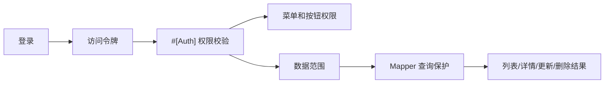

# 认证权限与数据范围

本系统的访问控制由三层组成：登录认证、接口权限、数据范围。登录解决“是谁”，接口权限解决“能做什么”，数据范围解决“能操作哪些数据”。

## 认证入口

认证入口按用户体系固定分离，用户模型由入口显式决定：

| 入口 | 接口前缀 | 登录主体 | 典型前端路径 | 权限来源 |
|------|----------|----------|--------------|----------|
| System 后台 | `/system/auth/*` | `SystemUser` | `/auth/login` | System RBAC：`system_role_node` |

插件前台入口不在 Web 壳中硬编码。需要独立登录页的插件应在自己的 `plugin.view_root` 下提供 `auth-entry.ts`，声明 `loginPath`、`authBase`、`routePrefixes`、`permissionPrefixes` 和用户模型匹配规则，Web 在编译期完成扫描，运行时只做通用消费。

System 后台核心接口：

- `POST /system/auth/login`
- `POST /system/auth/refresh`
- `POST /system/auth/profile`
- `GET /system/auth/codes`
- `POST /system/auth/logout`

低敏 UI 元信息是唯一的共享登录态例外：`/system/auth/ui-meta` 公开访问，服务登录页和启动初始化；`/system/data/ui-meta` 要求有效 Token，但用户模型声明为 `UserModelInterface`，因此可接受 `SystemUser` 或 `ProjectAccount`。该接口不能承载业务数据、权限码、个人资料或高敏系统配置。

### 登录态生命周期

1. 用户提交用户名、密码和可选附加参数到登录接口。
2. 服务端校验账号状态、密码和租户上下文。
3. 登录成功后返回访问令牌、用户信息、`auth_user_model` 和前端需要的基础权限信息。
4. 前端请求业务接口时携带访问令牌。
5. 访问令牌过期时，请求层调用刷新接口换取新令牌。
6. 刷新失败或登出后，前端清理本地登录态并回到登录页。

### 响应边界

- Token 缺失、过期、无效或刷新失败返回 `401`。
- Token 有效但没有接口权限返回 `403`。
- 账号密码错误、账号禁用等登录业务失败属于业务失败，按项目标准响应处理。
- 登录、登出、修改密码会记录操作日志，密码字段必须排除。

## 权限注解

受保护接口通过 `#[Auth]` 声明权限。`AuthAspect` 在运行时读取注解，并按注解声明的用户模型校验 Token 用户类型和权限码。`#[Auth]` 默认用户模型为 `SystemUser`；Project 前台接口必须显式声明 `userModel: ProjectAccount::class`。

默认 `#[Auth]` 会按 `SystemUser` 校验。只有少量跨入口共享且低敏的接口可以显式声明 `userModel: UserModelInterface::class`，例如已登录后的界面元信息；业务接口、资料接口和权限码接口必须继续使用具体用户模型，避免插件 Token 进入后台业务边界。

System 用户服务按职责拆分：`SystemUserSessionService` 只处理后台登录态恢复、在线会话和租户上下文；`UserPreferenceService` 只过滤 UI 偏好；`UserListSnapshotService` 只处理用户列表短期快照；`UserAccessCodeService` 只汇总 System RBAC 权限码；`UserAuthorizationBoundaryService` 只校验超级管理员保护、角色可授予边界和关联数据范围；`UserRelationAssignmentService` 只处理角色/部门/岗位关系同步与变更日志；`UserPasswordCredentialService` 只处理密码凭证规则和写入。`UserService` 保留为用户 CRUD 与 Controller 门面。

权限来源：

- Controller 上的 `#[Auth]`：定义模块级权限名称。
- Action 上的 `#[Auth]`：定义接口权限、权限码、是否作为菜单节点。
- `plugin.json` 菜单/按钮 code：补齐菜单和按钮节点。

### Auth 类型

| 类型 | 含义 | 使用场景 |
|------|------|----------|
| `Auth::LOGIN` | 只要求登录 | 当前用户资料、我的公告、用户菜单 |

`menu: true` 表示该权限可作为菜单入口同步；按钮和内部接口通常设置 `menu: false` 并显式配置 `code`。

### 权限码命名

建议使用 `<模块>.<资源>.<动作>`：

| 示例 | 含义 |
|------|------|
| `system.user.index` | 用户列表 |
| `system.user.update` | 编辑用户、状态、排序、关系分配 |
| `system.role.assign` | 角色授权 |
| `system.file.upload-config` | 上传通道配置 |

权限码必须和菜单按钮、前端按钮控制保持一致。不要复用无关模块的权限码来“临时放行”接口。

## 菜单与节点同步

| 命令 | 作用 |
|------|------|
| `xadmin:menu:sync --details` | 将插件 `plugin.json` 菜单清单同步到菜单表 |
| `xadmin:node:sync --details` | 汇总菜单 code 和 `#[Auth]` 注解同步权限节点 |

### 同步来源

| 来源 | 说明 |
|------|------|
| Controller `#[Auth]` | System 后台用户模型的注解生成接口权限节点 |
| `plugin.json` 菜单清单 | 生成菜单和按钮节点 |
| 前端按钮权限 | 使用权限码决定按钮显示 |
| 角色授权 | 选择 SystemUser 最终具备的节点 |

同步不会自动替你判断业务语义。新增接口时仍需要确认权限码命名、菜单层级和按钮归属是否合理。

## 数据范围

数据范围由 `ScopeService` 和各 Mapper 的作用域处理共同完成。标准 CRUD 默认通过 `CoreMapper` 的数据范围保护方法，避免普通用户越权读取、更新或删除数据。

常见范围：

- 全部数据
- 本部门及下级
- 本部门
- 本人
- 自定义部门

无法获取用户上下文时，数据权限必须 fail closed，不返回全量数据。

### 范围枚举

| 范围 | 含义 | 查询边界 |
|------|------|----------|
| 全部数据 | 可访问当前租户内全部受管数据 | 仍受租户上下文限制 |
| 自定义部门 | 可访问配置的部门集合 | 需要明确部门字段 |
| 本部门 | 可访问用户所属部门数据 | 依赖用户部门关系 |
| 本部门及下级 | 可访问用户部门和子部门数据 | 依赖部门树 |
| 仅本人 | 只访问当前用户创建或归属的数据 | 依赖创建人或用户字段 |

### 接入要求

新模块接入数据范围时要明确：

- 这张表的数据归属字段是什么，是 `created_by`、`user_id`、`dept_id`，还是业务自己的归属字段。
- 列表、详情、更新、删除、恢复、统计、选项接口是否都经过数据范围；前端导出是否复用受保护的列表接口。
- 无登录上下文、无用户部门、角色无效等异常场景是否 fail closed。
- 超级管理员是否真的需要绕过数据范围，绕过后是否仍受租户隔离。

### 常见风险

- 只在列表加数据范围，详情和更新仍可通过 ID 越权。
- 统计、选项接口忘记加数据范围，或前端导出绕过标准列表接口。
- `deptField` 为空或字段名来自请求参数，导致范围规则失效。
- 多角色范围合并策略和注释不一致。
- 原生 SQL 查询绕过 `CoreMapper`。

## 超级管理员

超级管理员拥有通配权限，校验时可短路权限节点。业务代码不能通过默认租户 ID 或空上下文绕过租户和数据范围。

超级管理员仍应遵守以下边界：

- 不把超级管理员判断散落在业务代码中，优先通过统一权限和上下文能力处理。
- 多租户场景下要显式区分平台管理员和租户管理员。
- 审计日志仍要记录超级管理员的关键操作。
- 高风险操作如彻底删除、清空日志、发布升级，应保留确认和备份策略。

## 排查方法

| 现象 | 排查顺序 |
|------|----------|
| 接口 401 | Token 是否携带、是否过期、刷新接口是否成功 |
| 接口 403 | 角色是否授权权限码、节点是否同步、前端是否使用了错误账号 |
| 菜单不可见 | 菜单状态、菜单 code、角色授权、用户菜单接口 |
| 按钮不可见 | 按钮节点、前端权限码、角色授权 |
| 数据不可见 | 角色 scope、用户部门、Mapper 数据范围字段 |
| 数据越权 | 详情/更新/删除/统计是否绕过数据范围 |

最后更新：2026-05-17
