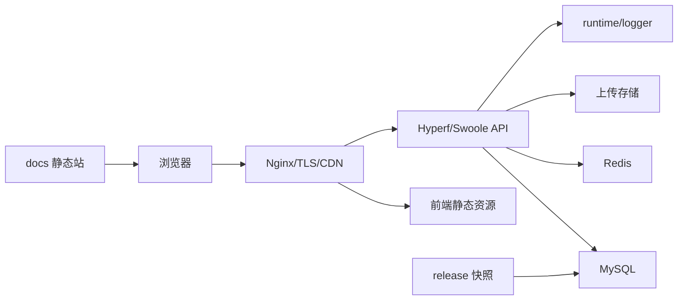

# 部署运维

本章面向部署和维护人员，覆盖本地开发、生产部署、Docs 静态站、发布升级、缓存、日志和上传配置。

## 运维目标

SmartAdmin 运维关注五件事：

1. 开发环境能快速启动和调试。
2. 生产环境服务稳定、配置安全、日志可追踪。
3. docs 独立静态站可部署、可缓存、可搜索。
4. 发布升级可 dry-run、可备份、可回滚。
5. 缓存、日志、上传和发布快照纳入日常维护。

## 运维入口

- [开发部署](./开发部署.md)
- [生产部署](./生产部署.md)
- [Docs 静态站](./Docs静态站.md)
- [发布升级](./发布升级.md)
- [缓存日志上传](./缓存日志上传.md)

## 环境分层

| 环境 | 目标 | 推荐动作 |
|------|------|----------|
| 本地开发 | 快速调试后端、前端、docs | 使用 `composer setup`、`composer docs:serve`、前端 dev server |
| 预发环境 | 模拟生产发布和升级 | 执行 `release:check`、升级 dry-run、回归验证 |
| 生产环境 | 稳定运行和可回滚 | 使用进程管理、反向代理、备份、日志归档 |
| docs 静态站 | 对外文档访问 | Nginx/Pages/对象存储静态托管 |

## 运行架构



docs 静态站与后端服务分开部署。后端负责 API 和管理端，docs 负责开源文档。

## 发布前检查

```bash
composer analyse
composer test
composer web:build
composer release:check
composer docs:check
```

纯文档变更至少执行 `composer docs:check`，并用 `composer docs:serve` 浏览关键页面。

## 日常维护清单

| 周期 | 检查项 |
|------|--------|
| 每次发布前 | `release:check`、docs 检查、升级 dry-run、备份可用性 |
| 每天 | 服务存活、错误日志、磁盘容量、数据库连接、Redis 连接 |
| 每周 | 上传目录或对象存储容量、日志增长、慢接口、失败登录 |
| 每月 | 备份恢复演练、依赖升级评估、权限审计、发布流程复盘 |

## 高风险操作

以下操作需要额外确认和备份：

- `xadmin:release:upgrade --force`
- `xadmin:release:restore --backup=<id>`
- 清空日志、彻底删除数据。
- 修改上传通道密钥或默认驱动。
- 修改租户状态或彻底删除租户。
- 修改角色授权、超级管理员、全部数据范围。

## 故障定位顺序

1. 看服务状态和端口。
2. 看浏览器 Network 和后端响应码。
3. 看后端 `runtime/logger`。
4. 看操作日志和请求日志。
5. 看数据库、Redis、对象存储连接。
6. 看最近发布、配置、菜单/节点同步和缓存清理记录。

最后更新：2026-04-27
