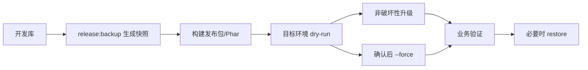

# 发布升级

SmartAdmin 的生产升级不依赖在目标环境逐条执行开发期迁移，而是通过 DBAL 快照比较结构和受管数据。这样可以把“开发期建表”和“生产发布升级”分开，降低私有化部署时的升级不确定性。



## 发布检查

```bash
composer release:check
```

该命令覆盖后端静态检查、单测、前端构建、发布快照 dry-run、菜单同步 dry-run 和权限节点同步 dry-run。

发布前至少确认：

| 项目 | 说明 |
|------|------|
| 代码检查 | `composer analyse` 通过 |
| 单测 | `composer test` 通过 |
| 前端构建 | `composer web:build` 通过 |
| 文档检查 | `composer docs:check` 通过 |
| 发布快照 | `composer release:snapshot` 通过 |
| 菜单节点 | menu/node sync dry-run 输出符合预期 |
| 备份策略 | 数据库、上传文件、`.env`、runtime 快照可恢复 |

## 数据库快照

发布系统使用 DBAL 快照机制：

```bash
composer release:backup
composer release:upgrade:dry-run
```

快照位置：

- `runtime/release/database.schema.gz`
- `runtime/release/database.data.gz`

### 表维护规则

发布配置位于 `config/autoload/release.php`，只允许使用：

| 配置 | 含义 |
|------|------|
| `backup_tables` | 发布包强制接管的数据表，升级前备份旧数据，升级时清空并用快照数据替换 |
| `ignore_tables` | 发布系统完全不维护的表，不进入结构 diff、不备份、不恢复、不删除 |

规则：

- `ignore_tables` 优先级高于 `backup_tables`。
- 用户业务数据、日志、租户运行数据通常不应进入 `backup_tables`。
- 菜单、权限节点、系统字典、种子类配置可以按项目策略纳入受管数据。
- 修改发布配置前必须先 dry-run，确认影响表列表。

## 升级命令

源码或 CI 环境可以直接使用 `sh bin/start-swoole` 预览发布升级：

```bash
sh bin/start-swoole xadmin:release:upgrade --dry-run --json
sh bin/start-swoole xadmin:release:upgrade
sh bin/start-swoole xadmin:release:upgrade --force
```

已发布二进制环境统一使用 `--self` 进入应用命令层：

```bash
./system-linux-x64 --self xadmin:release:upgrade --dry-run --json
./system-linux-x64 --self xadmin:release:upgrade
./system-linux-x64 --self xadmin:release:upgrade --force
```

默认只执行非破坏性结构同步；`--force` 才允许破坏性结构同步，但仍会跳过 `ignore_tables`。

### dry-run 输出关注点

执行 dry-run 后重点检查：

- 将执行的 SQL。
- 是否存在 drop、rename、change type、truncate 等破坏性动作。
- `ignore_tables` 是否被跳过。
- `backup_tables` 是否会备份并替换。
- 备份目录和备份 ID 是否可追踪。
- JSON 输出是否能被 CI 或发布平台消费。

### 非破坏性和破坏性

| 类型 | 示例 | 默认升级 |
|------|------|----------|
| 非破坏性 | 新增表、新增 nullable 字段、新增索引 | 允许 |
| 潜在破坏性 | 修改字段类型、缩短字段长度、删除索引 | 默认不允许 |
| 破坏性 | 删除表、删除字段、truncate 受管表 | 需要 `--force` 或受管数据替换规则 |

生产环境不要把 `--force` 作为默认发布参数。只有在评审 SQL、确认备份并完成维护窗口确认后再使用。

## 回滚

```bash
./system-linux-x64 --self xadmin:release:restore --backup=<id>
```

恢复只处理备份文件中包含的表，恢复前会 truncate 目标表。

回滚分两层：

| 层级 | 操作 |
|------|------|
| 代码回滚 | 切回上一版本代码或上一镜像，重启 Swoole |
| 数据回滚 | 使用 release backup ID 恢复受管表 |

注意：

- `restore` 只恢复备份包含的表，不会恢复上传文件和外部对象存储。
- 如果业务数据表属于 `ignore_tables`，发布系统不会替你恢复它。
- 回滚后优先验证登录、菜单、权限、文件上传和关键业务接口；如受管数据恢复导致权限注册表异常，再精确执行隐藏的菜单/节点同步修复命令。

## 命令分层

### 源码/CI 构建命令

以下命令主要在源码目录或 CI 中执行，用于开发、构建和发布包生成；其中前向迁移 `migrate` 可作为生产二进制补充升级入口，SmartAdminLibrary 提供的 `xadmin:plugin:*` 只服务源码插件 ZIP 与备份流程，backup 默认只备份代码，`--with-data` 才包含插件自有表，其他开发/构建/插件管理命令不会在已发布 Phar/SFX 二进制中注册或展示。

```bash
composer web:build
composer build
composer docs:check
composer release:backup
composer release:upgrade:dry-run
sh bin/start-swoole migrate
sh bin/start-swoole xadmin:menu:sync --details
sh bin/start-swoole xadmin:node:sync --details
sh bin/start-swoole xadmin:plugin:package Project -p <zip密码>
```

分阶段命令包括：

- `composer build:web`
- `composer build:sync`
- `composer build:clean`
- `composer build:install-prod`
- `composer build:snapshot`
- `composer build:phar`
- `composer build:cleanup`
- `composer build:restore-dev`

### 构建阶段说明

| 阶段 | 作用 |
|------|------|
| `build:web` | 独立构建前端静态资源，生成 `web/dist` |
| `build:sync` | 同步菜单和权限节点 |
| `build:clean` | 清理构建残留 |
| `build:install-prod` | 安装生产依赖 |
| `build:snapshot` | 生成发布数据库快照 |
| `build:precompile` | 预编译容器扫描缓存和构建清单 |
| `build:phar` | 打包 Phar |
| `build:audit` | 审计 SFX/Phar 产物、预编译缓存和前端资源包 |
| `build:cleanup` | 清理临时产物 |
| `build:restore-dev` | 恢复开发依赖 |

`composer build` 实际委托 `.php-sfx-packer.php build`，该编排器会先复用并校验已有 `web/dist/index.html`，再安全清理构建产物、安装生产依赖、生成预编译缓存、打包多架构 SFX 并执行审计。旧的 `build:*` 脚本保留用于分段调试；前端产物需要在打包前通过 `composer web:build` 或 CI 等价步骤提供。

### 已发布二进制命令

生产二进制只保留运行、前向迁移和必要维护入口，`list` 输出不会显示回滚/重置类迁移、seed、生成器、docs、build、plugin 管理和 release backup 命令：

```bash
./system-linux-x64 --self start
./system-linux-x64 --self list --raw
./system-linux-x64 --self xadmin:release:upgrade --dry-run --json
./system-linux-x64 --self xadmin:release:upgrade
./system-linux-x64 --self xadmin:release:restore --backup=<id>
./system-linux-x64 --self xadmin:pass:reset
./system-linux-x64 --self migrate:status
./system-linux-x64 --self migrate --pretend --force
./system-linux-x64 --self migrate --force
```

Hyperf 3.2 的前向迁移命令名是 `migrate`（不是 `migrate:run`）。它可作为生产二进制的补充升级入口；常规受管结构和数据仍推荐优先走 release 快照升级。发布包只保留 `migrate`、`migrate:install`、`migrate:status`，不会暴露 rollback/fresh/reset/refresh、`db:seed` 或 `gen:*`。生产迁移不要附带 `--seed`，因为 seed 命令不会在二进制中注册。Project 等业务插件可保留已确认的运行期任务命令，例如钉钉提醒和消息结果查询。

### 可选维护命令

`xadmin:site:publish` 仅用于 public 丢失、升级后需要重发前端资源，或维护窗口内清理静态资源：

```bash
./system-linux-x64 --self xadmin:site:publish --dry-run
./system-linux-x64 --self xadmin:site:publish
./system-linux-x64 --self xadmin:site:publish --clean
```

`xadmin:menu:sync` 和 `xadmin:node:sync` 在 Phar 模式隐藏但保留精确执行能力，仅用于权限表异常等极端修复；正常发布升级不再提示生产用户执行它们。

Phar 模式下发布快照位于二进制同级运行目录，不打入 Phar 包内。运行目录仍需要 `.env`、runtime、日志、上传文件和快照目录。前端资源位于 Phar 内 `storage/extra/web-dist.zip`，首次 `start` 或手动执行 `xadmin:site:publish` 时发布到 `public/`。

内置 `bin/swoole-*` 是精简 PHP 8.4 + Swoole 6.2 SFX 基库；如需自定义扩展或重新构建，可参考 [zoujingli/phpsfx](https://github.com/zoujingli/phpsfx)，本仓库不内置 phpsfx 构建工具。

## 发布流程建议

1. 在开发或 CI 环境执行完整检查。
2. 生成发布包和数据库快照。
3. 上传到预发环境，使用生产相似数据执行 dry-run。
4. 评审 SQL、受管表、忽略表、备份路径和菜单节点变化。
5. 在维护窗口部署代码，执行默认升级。
6. 如 dry-run 已确认需要破坏性同步，再人工执行 `--force`。
7. 验证登录、工作台、用户、角色、菜单、文件、日志、公告、租户和关键业务页面。
8. 保留本次发布包、备份 ID、SQL 输出和验证记录。

## 常见问题

- dry-run 显示业务表将被删除：检查 `ignore_tables`，不要让发布系统维护用户业务运行数据。
- 菜单发布后缺失：源码/CI 阶段检查插件 `plugin.json` 的应用、菜单和 view 声明，并确认构建期菜单与节点同步已执行；生产仅在极端修复时精确执行隐藏同步命令。
- 角色授权树没有新按钮：检查 Controller `#[Auth]` code 和构建期节点同步结果，生产环境不要把节点同步作为常规升级步骤。
- 需要执行迁移升级：使用 `<binary> --self migrate:status` 查看状态，先执行 `<binary> --self migrate --pretend --force` 预览 SQL，再执行 `<binary> --self migrate --force`；不要使用 `--seed` 或 rollback/fresh/reset/refresh 类命令做生产升级。
- Phar 启动后找不到快照：确认快照在二进制同级运行目录的 `runtime/release`。
- 二进制命令没有进入应用：使用 `<binary> --self <command>`，例如 `./system-linux-x64 --self start`。
- Phar 前端资源未发布：执行 `<binary> --self xadmin:site:publish --dry-run` 检查包内 `storage/extra/web-dist.zip`，再执行正式发布。
- 回滚后前端仍异常：清理浏览器缓存、CDN 缓存和前端 `_app.config.js` 配置。

最后更新：2026-05-19
