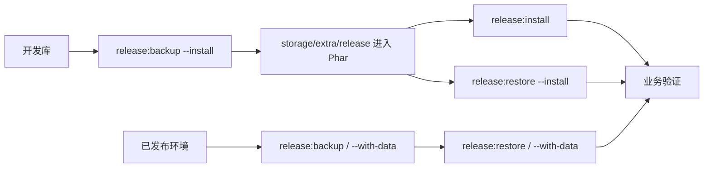

# 发布升级

SmartAdmin 的生产安装与升级不在目标环境执行完整迁移历史，而是使用 DBAL 快照安装包和运行备份。`migrate` 只用于源码/本地开发建表；正式 Phar/SFX 二进制通过 `restore` 恢复结构与数据。



## 发布检查

```bash
composer release:check
```

该命令覆盖后端静态检查、单测、前端构建、发布安装包生成与 `restore --install --dry-run`、菜单同步 dry-run 和权限节点同步 dry-run。

发布前至少确认：

| 项目 | 说明 |
|------|------|
| 代码检查 | `composer analyse` 通过 |
| 单测 | `composer test` 通过 |
| 前端构建 | `composer web:build` 通过 |
| 文档检查 | `composer docs:check` 通过 |
| 发布安装包 | `composer release:snapshot` 通过，Phar 内包含 `storage/extra/release/*` |
| 菜单节点 | menu/node sync dry-run 输出符合预期 |
| 备份策略 | 数据库、上传文件、`.env`、`runtime/backup` 可恢复 |

## 数据库安装包与运行备份

源码/CI 构建发布包时执行：

```bash
composer release:backup
composer release:restore:dry-run
```

其中 `composer release:backup` 等价于 `./bin/smart.php xadmin:release:backup --install`，生成待打包安装包：

- `storage/extra/release/database.schema.gz`
- `storage/extra/release/database.data.gz`
- `storage/extra/release/database.meta.json`

安装包只包含当前数据库全部表结构和 `backup_tables` 必要数据，`database.meta.json` 必须标记 `kind=install`、`with_data=false`。`--install --with-data` 被禁止，避免把运行期全量数据打入发布包。

运行时备份默认写入二进制同级运行目录：

```bash
./system-linux-x64 --self xadmin:release:backup
./system-linux-x64 --self xadmin:release:backup --with-data
```

- 不加 `--with-data`：`runtime/backup/<timestamp>/` 保存全部结构 + 必要数据。
- 加 `--with-data`：`runtime/backup/<timestamp>/` 保存全部结构 + 全部数据。
- 每次成功运行备份都会更新 `runtime/backup/latest`，恢复默认优先读取它；没有 latest 时选择最新时间目录。

### 表维护规则

发布配置位于 `config/autoload/release.php`，只允许使用：

| 配置 | 含义 |
|------|------|
| `backup_tables` | 必要数据表；不加 `--with-data` 时只备份和恢复这些表的数据 |
| `ignore_tables` | 不进入必要数据的表；优先级高于 `backup_tables` |

规则：

- 结构快照包含当前数据库全部表结构，包括日志表、运行表和 `migrations`。
- 用户业务数据、日志、租户运行数据通常不应进入 `backup_tables`。
- 菜单、权限节点、系统字典、种子类配置可以按项目策略纳入必要数据。
- 修改发布配置前必须先 dry-run，确认数据表列表和 SQL。

## 安装与升级命令

正式发布包首次初始化使用一键安装命令：

```bash
./system-linux-x64 --self xadmin:release:install --dry-run --json
./system-linux-x64 --self xadmin:release:install
```

`xadmin:release:install` 内部执行 `xadmin:release:restore --install`，然后发布 Phar 内前端资源到 `public/`。数据库安装包从 Phar 内 `storage/extra/release/` 读取：

- 按 DBAL 结构快照创建或同步数据表；
- 恢复 `backup_tables` 中的必要数据，例如 `system_menu`；
- 幂等补齐超级管理员、超级管理员角色、菜单、权限节点、通配权限绑定和系统展示参数；
- 不读取外置数据库安装包目录，发布包只需二进制和 `.env` 即可初始化。

发布升级不再使用历史专用升级入口，统一执行：

```bash
./system-linux-x64 --self xadmin:release:restore --install --dry-run --json
./system-linux-x64 --self xadmin:release:restore --install
```

若 dry-run 显示存在删除表、删除字段、字段类型变化等破坏性 SQL，默认会拒绝执行；确认已备份且处于维护窗口时再显式追加 `--force`：

```bash
./system-linux-x64 --self xadmin:release:restore --install --force
```

### dry-run 输出关注点

执行 dry-run 后重点检查：

- 将执行的 SQL。
- 是否存在 drop、rename、change type、truncate 等破坏性动作。
- `backup_tables` 必要数据是否符合预期。
- 备份目录和备份 ID 是否可追踪。
- JSON 输出是否能被 CI 或发布平台消费。

## 运行备份恢复

恢复最新运行备份：

```bash
./system-linux-x64 --self xadmin:release:restore --dry-run --json
./system-linux-x64 --self xadmin:release:restore
```

恢复最新全量运行备份：

```bash
./system-linux-x64 --self xadmin:release:restore --with-data --dry-run --json
./system-linux-x64 --self xadmin:release:restore --with-data
```

`--with-data` 只能恢复由 `xadmin:release:backup --with-data` 生成的备份；如果最新备份不是全量数据备份会直接报错。`--install --with-data` 被禁止。

注意：

- `restore` 会按备份结构同步数据库，并在恢复数据前 truncate 目标数据表。
- 非全量恢复只恢复必要数据，并会重新同步系统引导数据。
- 全量恢复会恢复备份中记录的全部数据表，不包含上传文件和外部对象存储。

## 命令分层

### 源码/CI 构建命令

以下命令主要在源码目录或 CI 中执行，用于开发、构建和发布包生成；`migrate` 只作为本地开发建表入口，正式 Phar/SFX 二进制不注册 migrate 命令。SmartAdminLibrary 提供的 `xadmin:plugin:*` 只服务源码插件 ZIP 与备份流程，backup 默认只备份代码，`--with-data` 才包含插件自有表，其他开发/构建/插件管理命令不会在已发布 Phar/SFX 二进制中注册或展示。

```bash
composer web:build
composer build
composer docs:check
composer release:backup
composer release:restore:dry-run
./bin/smart.php migrate
./bin/smart.php xadmin:menu:sync --details
./bin/smart.php xadmin:node:sync --details
./bin/smart.php xadmin:plugin:package Project -p <zip密码>
```

分阶段命令包括：

- `composer build:web`
- `composer build:sync`
- `composer build:clean`
- `composer build:install-prod`
- `composer build:snapshot`
- `composer build:phar`
- `composer build:cleanup`
- `composer build:restore-dev`

### 构建阶段说明

| 阶段 | 作用 |
|------|------|
| `build:web` | 独立构建前端静态资源，生成 `web/dist` |
| `build:sync` | 同步菜单和权限节点 |
| `build:clean` | 清理构建残留 |
| `build:install-prod` | 安装生产依赖 |
| `build:snapshot` | 生成 `storage/extra/release` 安装包 |
| `build:precompile` | 预编译容器扫描缓存和构建清单 |
| `build:phar` | 打包 Phar |
| `build:audit` | 审计 SFX/Phar 产物、预编译缓存、前端资源包和数据库安装包 |
| `build:cleanup` | 清理临时产物 |
| `build:restore-dev` | 恢复开发依赖 |

`composer build` 实际委托 `.php-sfx-packer.php build`，该编排器会先复用并校验已有 `web/dist/index.html`，再安全清理构建产物、生成 release 安装包、安装生产依赖、生成预编译缓存、打包多架构 SFX 并执行审计。`build:*` 分阶段脚本用于 CI 或人工分段调试；前端产物需要在打包前通过 `composer web:build` 或 CI 等价步骤提供。

### 已发布二进制命令

生产二进制只保留运行、release 安装/备份/恢复、前端发布、密码重置和必要业务运行入口，`list` 输出不会显示 migrate、rollback/fresh/reset/refresh、seed、生成器、docs、build、plugin 管理和历史发布升级专用命令：

```bash
./system-linux-x64 --self start
./system-linux-x64 --self list --raw
./system-linux-x64 --self xadmin:release:install --dry-run --json
./system-linux-x64 --self xadmin:release:install
./system-linux-x64 --self xadmin:release:backup --with-data
./system-linux-x64 --self xadmin:release:restore --with-data --dry-run --json
./system-linux-x64 --self xadmin:release:restore --install --dry-run --json
./system-linux-x64 --self xadmin:password:reset
```

`migrate` 只在源码/本地开发版本使用；正式打包环境通过 `xadmin:release:install` 完成首次安装，通过 `xadmin:release:restore --install` 完成发布升级，通过 `xadmin:release:backup` 与 `xadmin:release:restore` 做运行备份恢复。

### 可选维护命令

`xadmin:website:publish` 仅用于 public 丢失、升级后需要重发前端资源，或维护窗口内清理静态资源：

```bash
./system-linux-x64 --self xadmin:website:publish --dry-run
./system-linux-x64 --self xadmin:website:publish
./system-linux-x64 --self xadmin:website:publish --clean
```

`xadmin:menu:sync` 和 `xadmin:node:sync` 在 Phar 模式隐藏但保留精确执行能力，仅用于权限表异常等极端修复；正常发布升级不再提示生产用户执行它们。

Phar 内包含前端资源 `storage/extra/web-dist.zip` 和数据库安装包 `storage/extra/release/*`。运行目录仍需要 `.env`、runtime、日志和上传文件；运行备份写入二进制同级 `runtime/backup`。

内置 `bin/swoole-*` 是精简 PHP 8.4 + Swoole 6.2 SFX 基库；如需自定义扩展或重新构建，可参考 [zoujingli/phpsfx](https://github.com/zoujingli/phpsfx)，本仓库不内置 phpsfx 构建工具。

## 发布流程建议

1. 在开发或 CI 环境执行完整检查。
2. 生成发布包，确认 Phar 内数据库安装包完整。
3. 上传到预发环境，使用生产相似数据执行 `xadmin:release:backup --with-data`。
4. 执行 `xadmin:release:restore --install --dry-run --json`，评审 SQL、必要数据表和备份路径。
5. 在维护窗口部署代码，执行 `xadmin:release:restore --install` 或 `xadmin:release:install`。
6. 如 dry-run 已确认需要破坏性同步，再人工执行 `--force`。
7. 验证登录、工作台、用户、角色、菜单、文件、日志、公告、租户和关键业务页面。
8. 保留本次发布包、运行备份 ID、SQL 输出和验证记录。

## 常见问题

- dry-run 显示业务表将被删除：确认这是否来自安装包目标结构；破坏性 SQL 必须先做 `xadmin:release:backup --with-data`。
- 菜单发布后缺失：源码/CI 阶段检查插件 `plugin.json` 的应用、菜单和 view 声明，并确认构建期菜单与节点同步已执行；生产仅在极端修复时精确执行隐藏同步命令。
- 角色授权树没有新按钮：检查 Controller `#[Auth]` code 和构建期节点同步结果，生产环境不要把节点同步作为常规升级步骤。
- 正式二进制没有 migrate 命令：这是预期行为；首次安装使用 `<binary> --self xadmin:release:install`，升级使用 `<binary> --self xadmin:release:restore --install`。
- 运行备份找不到：确认备份位于二进制同级运行目录的 `runtime/backup`，或检查 `runtime/backup/latest` 是否指向存在的时间目录。
- 二进制命令没有进入应用：使用 `<binary> --self <command>`，例如 `./system-linux-x64 --self start`。
- Phar 前端资源未发布：执行 `<binary> --self xadmin:website:publish --dry-run` 检查包内 `storage/extra/web-dist.zip`，再执行正式发布。
- 回滚后前端仍异常：清理浏览器缓存、CDN 缓存和前端 `_app.config.js` 配置。

最后更新：2026-05-26
