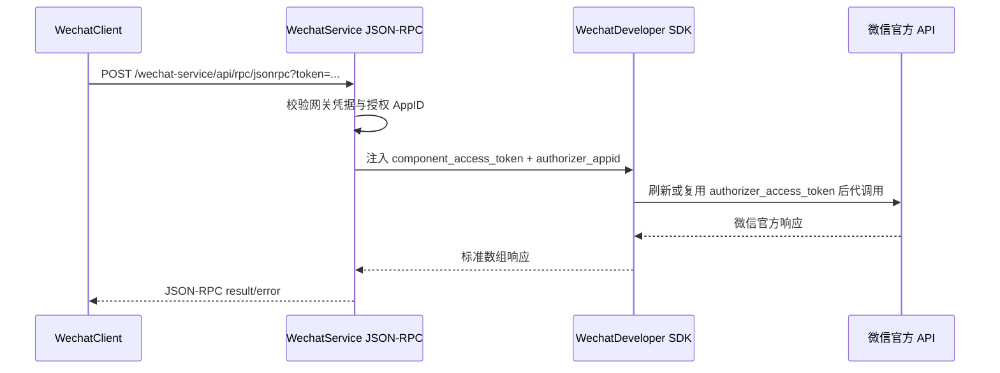

# 微信开放平台插件

> Apache-2.0 开源插件。面向 SmartAdmin 微信第三方平台接入，提供开放平台配置、授权账号管理、授权事件回调、普通消息回调和内部 JSON-RPC 网关。

## 开源协议

本插件随 SmartAdmin 以 Apache License 2.0 发布，允许在遵守协议要求的前提下使用、复制、修改、再分发和商业使用源码。

| 项目 | 说明 |
|---|---|
| 协议 | Apache License 2.0 |
| 代码包 | `zoujingli/smart_admin_plugin_wechat_service` |
| 运行环境 | SmartAdmin、PHP >= 8.4、Hyperf 3.2、Swoole 6 |
| 微信 SDK | `zoujingli/wechat-developer` 2.x |
| 问题反馈 | 通过 SmartAdmin Issue 或项目维护渠道提交可复现信息 |

> 注意：本插件开源不代表自动获得微信开放平台第三方平台资质。使用前请在微信开放平台创建第三方平台，配置授权事件接收 URL、消息与事件接收 URL、Token、EncodingAESKey，并遵守微信官方平台协议和数据安全要求。

## 功能地图

| 功能 | 后台入口 | 核心能力 | 关键边界 |
|---|---|---|---|
| 平台配置 | 微信开放平台 / 平台配置 | 第三方平台 AppID、AppSecret、Token、EncodingAESKey 与回调地址 | 敏感字段加密保存；回调安全模式必须验签解密 |
| 授权链接 | 微信开放平台 / 平台配置 | 基于 `component_verify_ticket` 生成授权 URL | 需要先收到 Ticket 回调；授权回调会绑定租户 |
| 授权账号 | 微信开放平台 / 授权账号 | 保存授权公众号/小程序资料、刷新状态、同步官方资料 | 授权账号按 AppID 唯一，回调场景跨租户定位后恢复上下文 |
| 接口网关 | 微信开放平台 / 接口网关 | 为 WechatClient 开放内部 JSON-RPC 代调用 | 只允许相对微信 API path；服务端注入授权方 token，客户端不能覆盖 |
| Ticket 回调 | `/wechat-service/api/callback/ticket` | 接收 `component_verify_ticket` 与授权事件 | 公开入口但必须验签/解密；事件会写入回调日志 |
| 消息回调 | `/wechat-service/api/callback/notify/{appid}` | 接收授权账号普通消息并分发给 WechatClient | 必须使用带授权 AppID 的标准路由 |

## 快速接入

1. 在微信开放平台创建第三方平台，并获取 Component AppID、AppSecret、Token、EncodingAESKey。
2. 在后台“微信开放平台 / 平台配置”保存参数。
3. 在微信开放平台配置授权事件接收 URL：`/wechat-service/api/callback/ticket`。
4. 配置授权账号消息与事件接收 URL：`/wechat-service/api/callback/notify/$APPID$`。
5. 等待微信推送 `component_verify_ticket` 后，在后台生成授权链接并完成租户绑定。
6. 如需让 WechatClient 通过开放平台代调用，创建接口网关凭据，并在 WechatClient 接口账号中配置 JSON-RPC 地址、Key 和 Secret。
7. 使用 [微信开放平台接口文档](../../docs/接口参考/微信开放平台接口.md) 进行接口联调。

## 网关调用模型

## 目录规范

- `src/`：插件运行期 PHP 代码，包含 `Controller`、`Service`、`Mapper`、`Model`、`Support` 等目录。
- `stc/view/`：插件前端页面与组件资源，由 `plugin.view_root` 显式启用。
- `stc/languages/`：插件语言包，由 `plugin.language_root` 显式启用。
- `stc/migrations/`：插件开发期数据库迁移文件，由 `plugin.migration_root` 显式启用。
- `composer.json`：插件包元数据、autoload 与 Hyperf Provider 配置。
- `plugin.json`：应用、菜单、view、按钮权限和模块元数据清单。

## 数据库命名规范

WechatService 模块数据库表统一使用 `wechat_service_` 前缀，Model 必须显式声明 `$table`，避免类名调整后依赖自动推导产生偏差。

| 业务实体 | 表名 | 代码命名 |
|---|---|---|
| 开放平台配置 | `wechat_service_config` | `WechatServiceConfig*` |
| 授权账号 | `wechat_service_auth` | `WechatServiceAuth*` |
| 接口网关凭据 | `wechat_service_gateway` | `WechatServiceGateway*` |
| 回调日志 | `wechat_service_logger` | `WechatServiceLogger*` |

命名约束：

- `auth` 表示开放平台授权账号的本地授权记录，字段仍保留微信官方术语 `authorizer_appid`、`authorizer_access_token` 等。
- `logger` 表示开放平台回调日志记录，用于 Ticket、授权事件和授权账号消息回调的结构化审计。
- `gateway` 表示内部 JSON-RPC 接口网关凭据，不再使用 `gateway_credential` 作为表名或类名前缀。
- 新增迁移文件、索引名和表注释必须与表名语义保持一致，并继续使用模块前缀隔离不同插件的数据表。

## 约束

运行期类命名空间保持不变，仅通过 composer autoload 将命名空间根目录指向 `src/`。
页面、语言包和迁移目录均由 `plugin.json` 的资源根字段声明；未配置的资源不会被运行时或构建流程自动扫描。
